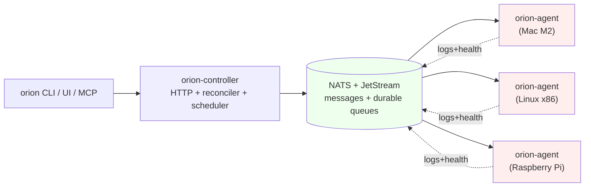

# OrionMesh

**A "Kubernetes-lite" orchestrator for a heterogeneous personal cluster.** Schedule workloads across your Macs, Linux boxes, and Raspberry Pis with capability-aware placement, native execution (no mandatory Docker), durable queues, and a workflow engine — all from a single Rust binary stack.

> Run the right workload, on the right machine, with the right data, using the right runtime.



## What OrionMesh is

A **single control plane** for a small cluster of mixed-architecture machines
that you actually own. You declare what should run (Services, Tasks,
Queues, Workflows) as YAML resources. The controller stores them, picks a
node with matching capabilities, and dispatches them via NATS. Agents launch
the workload **as a native OS process** — no container required — and pipe
its stdout/stderr back through the bus.

It is **not** a Kubernetes replacement. It's deliberately one-controller,
one-broker, mostly in-memory, native-first. If you have 1–20 machines and
want orchestration without a 50MB-of-YAML / 6-DaemonSet tax, this is for
you.

## What OrionMesh does

- **Schedule and dispatch workloads** to specific nodes via NATS, choosing
  the best target with a capability + placement filter and a load-aware
  score.
- **Reconcile desired vs observed state** — if a Service declares
  `replicas: 3` and one crashes, the reconciler restarts that one specific
  slot (per-slot tracking, not "kill them all and respawn").
- **Run health probes** (HTTP / TCP / Exec). If a probe crosses
  `failure_threshold`, the reconciler treats the instance as failed and
  applies the `restart_policy` — independent of whether the process itself
  exited.
- **Operate named queues** backed by JetStream — declared as Resources with
  `type: work` (load-balanced, one-of-N delivery) or `type: topic`
  (broadcast). Pipe data in from the CLI, process it with a service of
  any language.
- **Run workflows** — DAGs of Tasks with `depends_on` edges, fail-fast or
  `continue_on_error`, watched by the controller and fanned out as
  upstream Tasks complete.
- **Discover capabilities** — `POST /v1/find` returns the subset of
  services matching a selector (`{ "llm": { "min_vram_gb": { "gte": 24 } } }`).
- **Persist history** — a SQLite log archive mirrors every workload's
  stdout/stderr so logs survive a controller restart. Metrics exposed at
  `/metrics` for Prometheus scraping.
- **Compose with Claude / MCP hosts** — the bundled `orion-mcp` server
  exposes 13 tools over JSON-RPC stdio so an LLM agent can drive the
  cluster directly.

## Why you'd want it

- **Mixed hardware is normal**. A Mac mini + a couple of Pis + an old Linux
  box is what most homelabs look like. Kubernetes makes you pay for
  every architecture mismatch; OrionMesh treats `arch / os / gpu /
  acceleration` as first-class placement constraints.
- **Native-first, not Docker-first**. Running Python via
  `runtime: { kind: native, exec: python, args: […] }` is one line and
  uses your host venv. A Docker adapter exists for when you want it
  (sealed images, untrusted code, weird dependencies); it's never a
  requirement.
- **Capability-aware**, not just label-aware. Services advertise what they
  *can do* (which dataset, which model variant, which protocol). Clients
  query for what they *need*. That's how you wire "find me an LLM with
  ≥24 GB VRAM" without hardcoding hostnames.
- **One control plane, one binary stack**. `orion-controller` + N
  `orion-agent`s + NATS. No etcd, no kubelet, no CRDs, no operators. The
  whole control plane fits in a Mac mini and idles at near-zero CPU.
- **Honest substrate**. The pieces you can verify with `orion doctor`:
  - Reconciler with per-slot tracking and restart-on-unhealthy
  - Multi-node scheduler with filter + score + load tiebreaker
  - Health probes (HTTP / TCP / Exec)
  - Find API
  - Named queues + workflows
  - Docker + Wasm runtime adapters
  - SQLite log archive + Prometheus metrics + backup/restore
  - MCP server, TUI dashboard, browser UI

## 60-second tour

```bash
# 1. Install — builds the binaries + downloads native nats-server, no Docker needed
git clone https://github.com/geekychris/orion_mesh
cd orion_mesh
./scripts/install-bins.sh --with-nats

# 2. Start the local stack (NATS + controller + agent)
orion up &

# 3. In another shell — declare a queue, pipe ps -ef through it
orion gen queue ps-rows --type work | orion apply -f -
ps -ef | orion json | orion queue pub ps-rows

# 4. Scaffold a Python processor that consumes the queue
orion init processor row-cruncher --queue ps-rows --lang python
bash row-cruncher/setup.sh
orion apply -f row-cruncher/row-cruncher.yaml
orion dispatch Service row-cruncher
orion logs Service row-cruncher --follow
```

That's the actual `examples/10-queues/` walkthrough, runnable as-is.

## Where to go next

- **[docs/quickstart.md](docs/quickstart.md)** — the same 60-second tour
  with explanations and the per-step output you should see.
- **[docs/README.md](docs/README.md)** — index of every doc, grouped by
  what you're trying to do.
- **[examples/](examples/)** — 14 numbered directories
  (`00-canonical`–`13-mcp`). Every one has a runnable README; pass it to
  `scripts/run-md.py` to execute end-to-end.
- **[docs/runtime.md](docs/runtime.md)** — the native-first stance,
  adapter status, when (if ever) you'd want Docker.
- **[docs/multi-host.md](docs/multi-host.md)** — running the controller
  and agents on separate machines (the actual point of a "mesh").
- **[CLAUDE.md](CLAUDE.md)** — every locked-in design decision, with
  rationale. Read before changing wire formats.

## Status

Phases 1–5 are closed (June 2026). What's wired up vs stubbed lives in
the table at [`CLAUDE.md`](CLAUDE.md#whats-wired-up-vs-stubbed). Roadmap
ahead:

- **Phase 6** — Dev Portal peer integration (GitHub portfolio surface)
- **Phase 7** — Home Assistant + Telegram integrations
- **Always** — runtime adapters for Python venv, Java, Node, Spark, LLM,
  Home Assistant when there's a real reason to upgrade past
  `kind: native`

Tests: **166 default + 4 wasm + 1 live docker = 171 passing**. CI runs
fmt + clippy + the full test matrix on every push.

## Quick references

| What | Where |
|---|---|
| Install | [`scripts/install-bins.sh`](scripts/install-bins.sh) |
| All resource kinds (Service, Task, Queue, Workflow, Schedule, …) | [`crates/orion-types/src/specs.rs`](crates/orion-types/src/specs.rs) |
| REST API surface | [`crates/orion-controller/src/main.rs`](crates/orion-controller/src/main.rs) (search for `.route(`) |
| Reconciler decision logic | [`crates/orion-controller/src/decisions.rs`](crates/orion-controller/src/decisions.rs) |
| CLI subcommands | [`crates/orion-cli/src/cmd/`](crates/orion-cli/src/cmd/) |
| MCP tools | [`crates/orion-mcp/src/lib.rs`](crates/orion-mcp/src/lib.rs) |

License: Apache 2.0 OR MIT.
