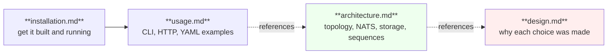

# OrionMesh docs

Capability-aware orchestration for a heterogeneous personal cluster. Run the right workload, on the right machine, with the right data, using the right runtime.

| Doc | Start here when… |
|---|---|
| [installation.md](installation.md) | You want to build OrionMesh, configure auth, or run it as a system service |
| [usage.md](usage.md) | You want to author resources, drive the CLI, or hit the HTTP API |
| [architecture.md](architecture.md) | You're modifying the code or trying to understand how the pieces talk |
| [design.md](design.md) | You're considering reversing a decision and want the trade-off recorded |

## Quick links

- Repository: <https://github.com/geekychris/orion_mesh>
- Original short plan: [../OrionMesh_Architecture_Plan.md](../OrionMesh_Architecture_Plan.md)
- Full plan (authoritative): [../OrionMesh_Complete_Plan.md](../OrionMesh_Complete_Plan.md)
- Locked-in decisions index: [../CLAUDE.md](../CLAUDE.md)

## Status at a glance

| | Phase 1 | Phase 2 | Phase 3 | Phase 4 | Phase 5 | Phase 6 | Phase 7 |
|---|---|---|---|---|---|---|---|
| Agent + heartbeats + CLI | ✅ | | | | | | |
| Native task execution + log forwarder | substrate | 🚧 | | | | | |
| Service registry + capability lookup | substrate | | 🚧 | | | | |
| Docker runtime adapter | substrate | | | 🚧 | | | |
| Reconciler + scheduler dispatch | substrate | | | | 🚧 | | |
| Dev Portal peer integration | sketch live | | | | | 🚧 | |
| HA / Telegram / MCP | | | | | | | 🚧 |

"substrate" = the shape exists, the loop doesn't.
