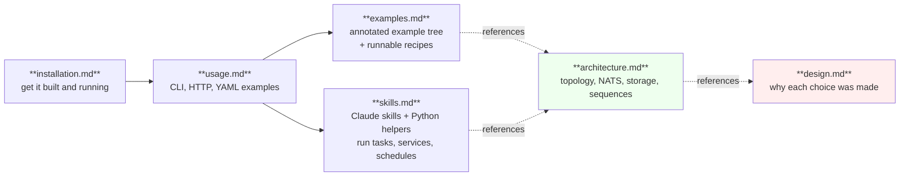

# OrionMesh docs

Capability-aware orchestration for a heterogeneous personal cluster. Run the right workload, on the right machine, with the right data, using the right runtime.

| Doc | Start here when… |
|---|---|
| [quickstart.md](quickstart.md) | You just installed and want a 5-minute end-to-end test — pipes `ps -ef` through a queue into a Python service |
| [installation.md](installation.md) | You want to build OrionMesh, configure auth, or run it as a system service |
| [usage.md](usage.md) | You want to author resources, drive the CLI, or hit the HTTP API |
| [examples.md](examples.md) | You want a guided tour of the `examples/` tree with copy-pasteable CLI recipes |
| [skills.md](skills.md) | You want Claude (or scripts) to drive OrionMesh for you — apply, dispatch, schedule, tail logs |
| [ipc.md](ipc.md) | You want to know how Services talk to each other, what `replicas:` does, fan-out vs queue-group vs JetStream, and how the polyglot demos work |
| [diagnostics.md](diagnostics.md) | You want to debug or monitor — `/v1/diag/*` endpoints, UI Diag tab, `orion-diag` skill, stop-by-name |
| [debugging.md](debugging.md) | You want to debug a workload, a component, or live cluster state — covers all three layers |
| [debugging-processors.md](debugging-processors.md) | You want to attach a debugger to a Python or Java queue processor (debugpy / JDWP) |
| [queues.md](queues.md) | You want to author or operate named queues — work vs topic, lifecycle, ls / describe / purge |
| [runtime.md](runtime.md) | You want to know what `kind:` runtimes are wired up and why OrionMesh is native-first |
| [runner.md](runner.md) | You want to know how `scripts/run-md.py` works — tag conventions, drive flags, authoring runnable READMEs |
| [architecture.md](architecture.md) | You're modifying the code or trying to understand how the pieces talk |
| [design.md](design.md) | You're considering reversing a decision and want the trade-off recorded |

## Quick links

- Repository: <https://github.com/geekychris/orion_mesh>
- Original short plan: [../OrionMesh_Architecture_Plan.md](../OrionMesh_Architecture_Plan.md)
- Full plan (authoritative): [../OrionMesh_Complete_Plan.md](../OrionMesh_Complete_Plan.md)
- Locked-in decisions index: [../CLAUDE.md](../CLAUDE.md)
- Examples tree: [../examples/](../examples/)

## Status at a glance

| | Phase 1 | Phase 2 | Phase 3 | Phase 4 | Phase 5 | Phase 6 | Phase 7 |
|---|---|---|---|---|---|---|---|
| Agent + heartbeats + CLI                  | ✅ | | | | | | |
| Native task execution + log forwarder      | ✅ | ✅ | | | | | |
| `POST /v1/dispatch` + `GET /v1/logs` end-to-end | ✅ | ✅ | | | | | |
| Cron scheduler tick (Schedule actually fires) | ✅ | ✅ | ✅ | | | | |
| NATS IPC between Services (demo-pub / demo-sub) | ✅ | ✅ | ✅ | | | | |
| Service registry + capability lookup (Find API) | substrate | | | 🚧 | | | |
| Docker / Python / Java runtime adapters    | substrate | | | | 🚧 | | |
| Reconciler + multi-node scheduler (filter+score) | substrate | | | | 🚧 | | |
| Dev Portal peer integration                | sketch live | | | | | 🚧 | |
| HA / Telegram / MCP                        | | | | | | | 🚧 |

"substrate" = the shape (trait, types, in-mem index, NATS topic) exists; the closed loop doesn't.

## What you can literally do today

Open the UI at `http://127.0.0.1:7879` (after starting the local stack — see [installation.md §6](installation.md#6-local-dev--fastest-path)):

- **Browse + edit + delete** every resource kind (Service, Task, Schedule, Dataset, Model, Runtime, Capability, …) — see [usage.md §3](usage.md#3-authoring-resources)
- **Dispatch a Service or Task** with `runtime: native` — the agent launches it, stdout/stderr stream into the UI's Logs panel — [examples.md §01-services](examples.md#01-services), [§02-tasks](examples.md#02-tasks)
- **Apply a Schedule** with `cron: "* * * * *"` — it fires within the next minute mark; the Cron observer panel shows `last_fired_at` / `next_fire_at` / `fire_count` — [examples.md §03-schedules](examples.md#03-schedules)
- **IPC demo** — apply + dispatch the publisher + subscriber demo Services from the `Demo` tab; watch the same NATS-mediated messages in two side-by-side log tails — [examples.md §09-ipc](examples.md#09-ipc)
- **Validate without storing** via `POST /v1/resources/apply?dry_run=1`
- **Simulate** capability matching + placement filtering from the Demo tab without applying anything
