# Architecture

This document describes OrionMesh's runtime topology, the resource model, the NATS contract, persistence, and the lifecycle of common operations. Diagrams are mermaid — they render natively on GitHub.

For the *why* behind each choice see [design.md](design.md). For how to actually run it see [installation.md](installation.md) and [usage.md](usage.md).

---

## 1. Bird's-eye view

OrionMesh is a controller-plus-agents mesh communicating over a NATS bus. Persistence is local to the controller (SQLite). Peer systems — Dev Portal, KQueue — are reachable over HTTP and treated as optional catalogs, never hard dependencies.

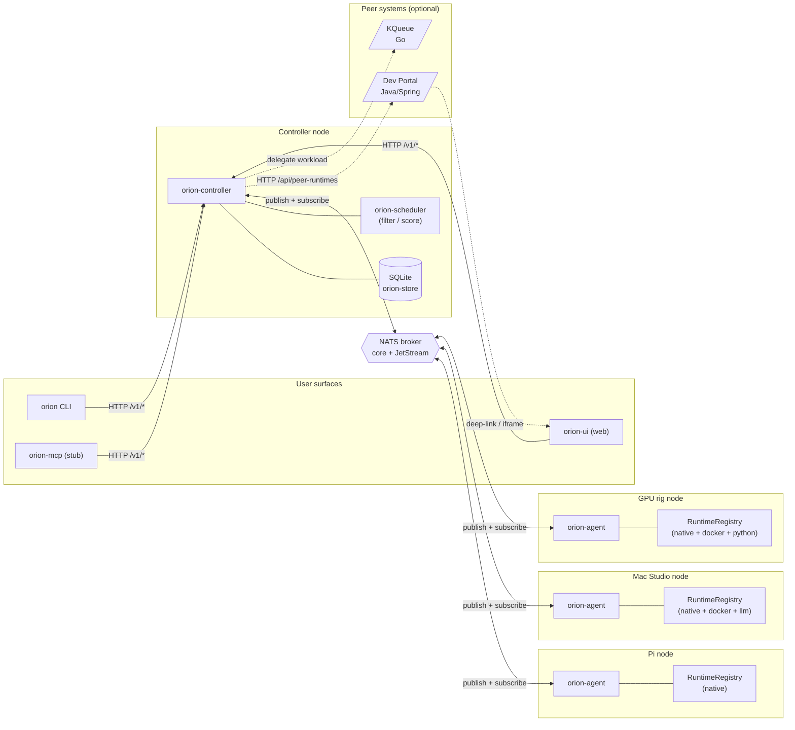

Boundaries to respect:

| Pair | Transport | Authority |
|---|---|---|
| User → Controller | HTTP (bearer) | Controller owns desired state |
| Controller → Agent | NATS `orion.control.{node}.*` | Controller owns scheduling decisions |
| Agent → Controller | NATS data plane | Agent owns observed-node truth |
| Controller → Dev Portal | HTTP | Dev Portal owns asset metadata; OrionMesh writes the runtime catalog entry |
| Controller → KQueue | HTTP via Dev Portal catalog | KQueue runs its own workloads |

---

## 2. Crate map

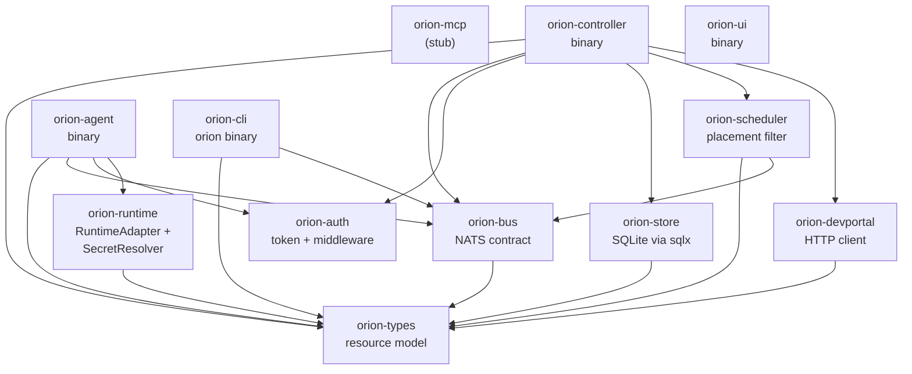

A new feature usually touches at most three crates: a type in `orion-types`, a message in `orion-bus`, and the consumer (`orion-agent` or `orion-controller`). If a change cuts across more, it's a sign the layering needs revisiting.

---

## 3. Resource model

Every desired-state document on the wire has the same four-block layout. Internally, the variant is a tagged enum (`kind:`) and apiVersion + metadata sit alongside it via `serde(flatten)`.

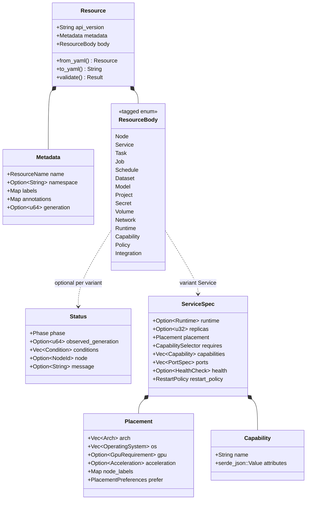

The full set of `*Spec` types lives in `crates/orion-types/src/specs.rs`. Each kind has a roundtrip test against canonical YAML.

### Capability and selector

Capabilities are how services advertise *what they can do* — not just by name. The selector reuses the same shape; matching is structural on the JSON.

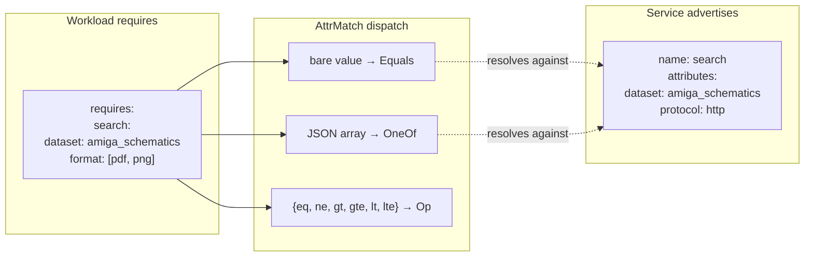

`AttrMatch` has a custom `Deserialize` impl because `serde(untagged)` mis-routes arrays to `Equals(Value)` (Value accepts any JSON type).

---

## 4. NATS topic map

Hybrid namespace: wide control plane (per-node subjects, NATS subject-side filtering), consolidated data plane (one stream per concern with the discriminator in the payload).

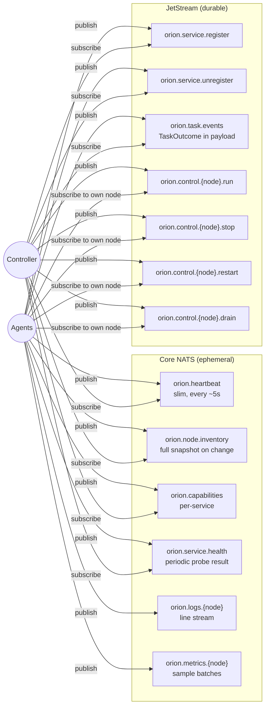

`Topic::requires_jetstream()` is the source of truth for which topics get durability. Adding a topic: extend `Topic`, define a payload in `crates/orion-bus/src/messages/`, decide the durability tier, write a roundtrip test in `crates/orion-bus/src/tests.rs`.

---

## 5. Storage schema

SQLite via `sqlx`. Migrations live under `crates/orion-store/src/migrations/`. Body is the JSON serialization of `Resource`; generation bumps only when the body actually changes.

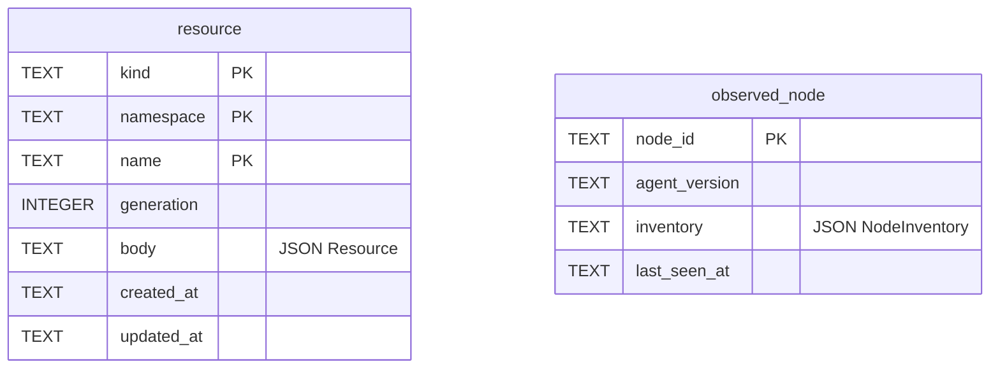

Phase-1 schema is intentionally thin. Future migrations add Job history, observed-service state, scheduler decisions, audit events.

---

## 6. Lifecycles

### 6.1 Agent boot → heartbeat → controller persistence

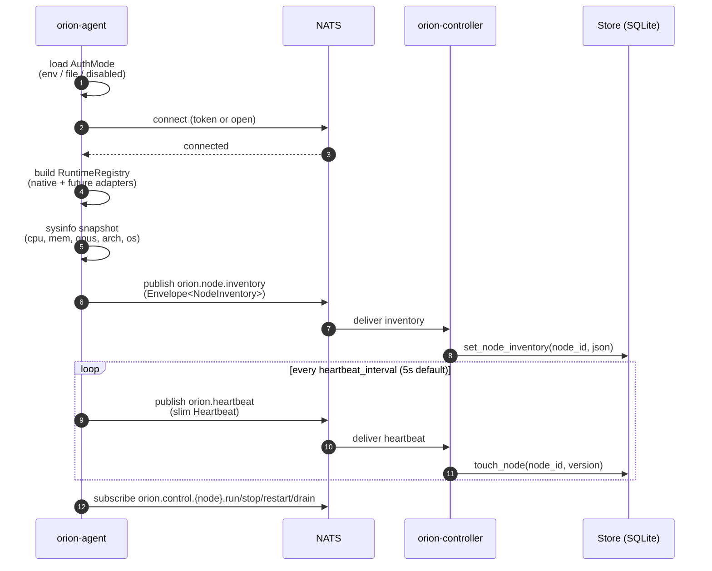

### 6.2 `orion apply -f svc.yaml` (current MVP)

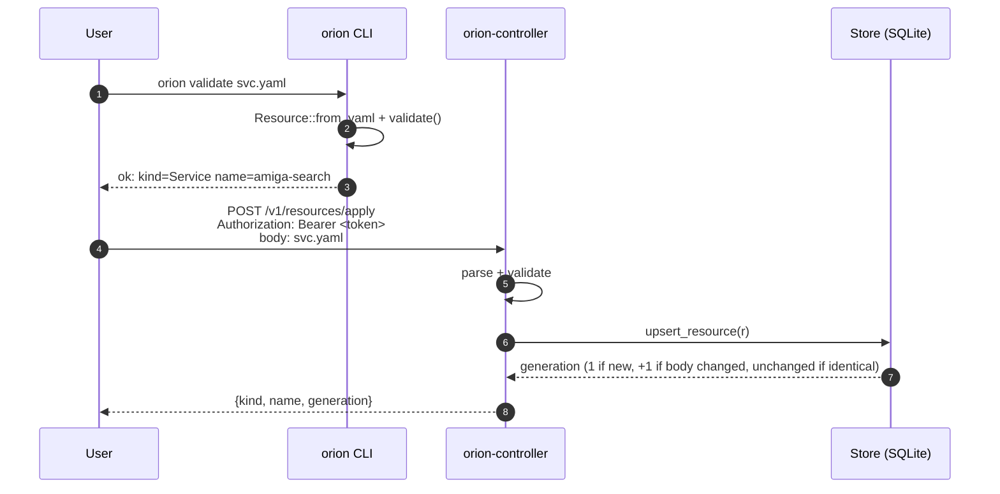

### 6.3 Direct dispatch + stdout/stderr capture (Phase A — live)

`POST /v1/dispatch/{kind}/{name}` picks a node (currently "most-recent live"; full scheduler is Phase 5), publishes `ControlRun`, the agent launches via the runtime adapter, and stdout/stderr stream back to a ring buffer the UI tails.

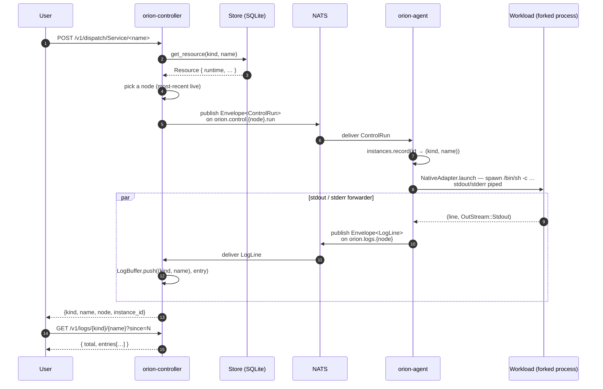

Phase 5 replaces "pick a node (most-recent live)" with the real scheduler — `filter_nodes_by_placement` + scoring + capability index.

### 6.4 Scheduler tick — Schedules firing on cron (Phase B — live)

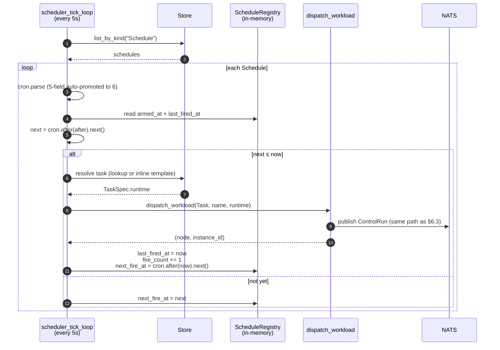

Observable via `GET /v1/schedules/observed` — returns `armed_at`, `last_fired_at`, `last_instance_id`, `next_fire_at`, `fire_count`, `last_error` per Schedule.

### 6.5 IPC over NATS — two Services talking (Phase C — live)

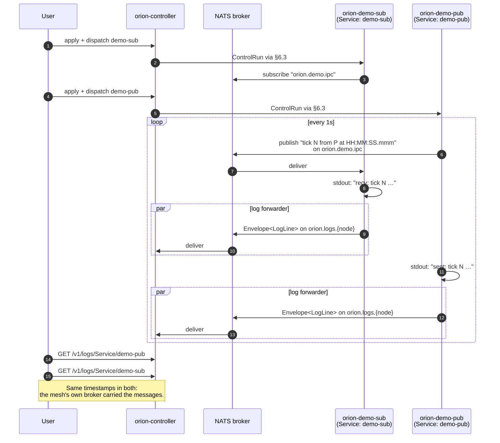

The IPC subject is **distinct from the control plane subjects** — workloads share NATS with the mesh but the namespaces don't overlap.

### 6.6 Peer integration — Dev Portal registration

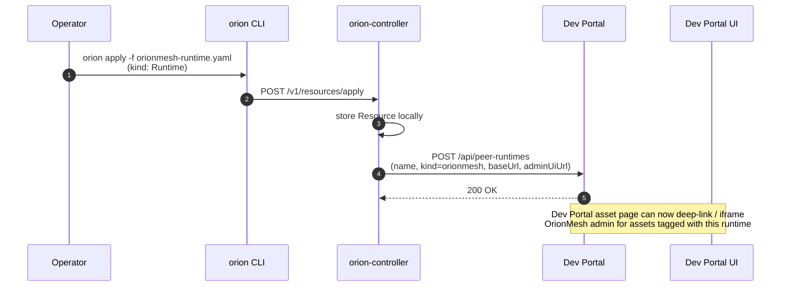

Both sides continue to work when the other is unreachable. Stub mode in `orion-devportal` (no base URL) makes every call return `NotConfigured`.

---

## 7. Auth model

Single shared cluster token. NATS uses it as the connection token; HTTP uses it as a bearer. `ORION_AUTH_DISABLED=1` shorts both for dev.

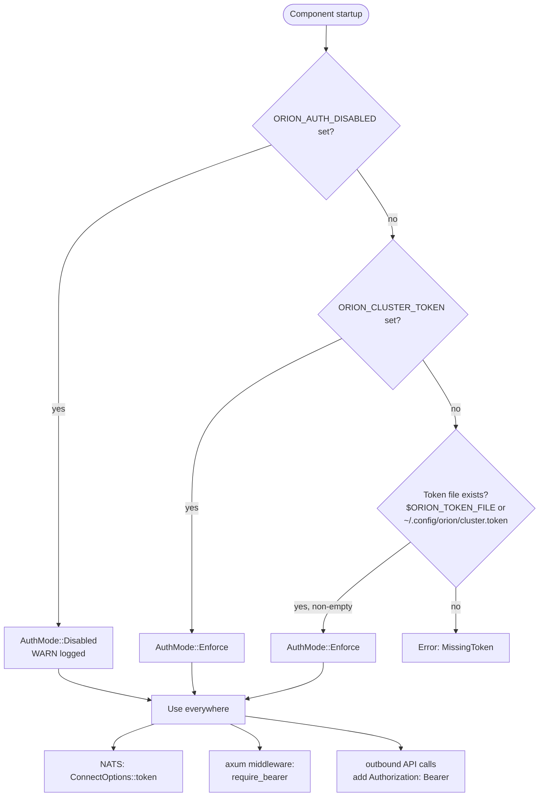

`/health` on the controller is intentionally *outside* the auth layer so liveness probes don't need the token.

---

## 8. What's not in this document

- **Reconciler internals** — Phase 5. Today dispatch is operator-initiated (via `POST /v1/dispatch/...` or the scheduler tick); the closed loop where the controller compares desired vs observed and decides to dispatch on its own is the next layer.
- **Full scheduler** — Phase 5. Today's pick-a-node logic is "most-recent live"; the filter+score+place pipeline ships with the reconciler.
- **Find API** — Phase 4. The capability index exists in [`crates/orion-types/src/capability.rs`](../crates/orion-types/src/capability.rs); the `POST /v1/find` endpoint lights it up.
- **Federation across sites** — out of MVP scope (mentioned in plan future ideas).
- **MCP server tools** — `orion-mcp` is a stub; the tool surface lands in Phase 7.

See [design.md](design.md) for the reasoning behind these omissions and the broader trade-offs.
