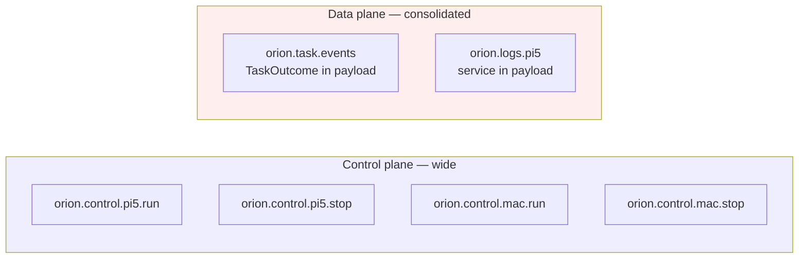
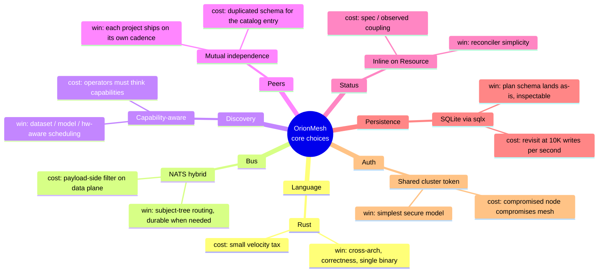

# Design

The *why* behind every locked-in choice in [CLAUDE.md](../CLAUDE.md). This document is the audit trail — when someone (including future-you) revisits a decision, they should be able to find the trade-off here without re-doing the research.

For *what* was decided see [CLAUDE.md](../CLAUDE.md). For *how it's wired* see [architecture.md](architecture.md). For *how to run it* see [installation.md](installation.md) and [usage.md](usage.md).

---

## 0. Operating principles

These shape every individual decision below.

1. **Plan-faithful by default.** `OrionMesh_Complete_Plan.md` is the spec; we deviate only where the plan is vague or where reality forces it.
2. **Peer-with-mutual-independence.** OrionMesh never hard-requires Dev Portal or KQueue. Dev Portal never hard-requires OrionMesh. Each is a peer registered through a stable contract.
3. **Optimize for one operator on a small heterogeneous fleet.** Not K8s scale; not enterprise. If a feature only pays off above 100 nodes, defer it.
4. **Lock in the contract, not the implementation.** Resource model, NATS topics, HTTP routes are the durable surface. Adapters, persistence backends, and crate boundaries can move.

---

## 1. Why all-Rust

Considered: polyglot (Go agent, Java controller), all-Go (matches KQueue), all-Java (matches Dev Portal), all-Rust, all-Rust-with-Java-edges.

Picked: **all-Rust** for the OrionMesh core (agent, controller, CLI, UI server, libraries). Java/Spring stays on the Dev-Portal side; integration is over HTTP + MCP, not native interop.

Why:

- **Single static binary cross-compiled to Pi ARM64, Mac arm64, Linux x86_64.** A JVM agent on every Pi node is a non-starter; Go gives the same cross-compile win but doesn't compose with the rest of the portfolio's strongest areas (gravel — Rust, embedded — Rust).
- **Strong correctness story for the reconciliation loop.** The scheduler / reconciler is small, has to be right, and rewards `Result`-everywhere. Async Rust paid off in the agent's per-node control-plane subscriber tree.
- **Shared types from the wire to the store.** `Resource` is the same struct that comes off NATS, lives in SQLite, and gets emitted by the CLI. One serde derive covers all three. Polyglot would have meant two type definitions and a serialization contract between them.
- **Velocity tax is real but bounded.** The bus + types crates have ~500 lines of declarations; the agent and controller are ~200 lines each. The tax is real — `f32` not implementing `Eq`, `gen` becoming a keyword in edition 2024 — but visible and fixable, not a steady drag.

Where Rust loses: the Dev-Portal-side scanner / catalog UI is Java/Spring and stays that way. OrionMesh meets it at HTTP.

---

## 2. Why NATS — and why hybrid namespace

Considered for the bus: NATS, Redis Streams, Kafka, gRPC-only, plain HTTP.

Picked: **NATS Core + JetStream**, with subjects split into a wide control plane (per-node subjects) and a consolidated data plane (one topic per concern, discriminator in payload).

### Why NATS at all

- **~10M msg/s on a laptop** — more than the personal cluster will ever need; throughput is irrelevant, latency under load is the real win.
- **Official clients in every language the portfolio uses.** Future Go/Java/Python services can drop onto the bus with no contract bridge.
- **JetStream gives durable consumer groups** without a Kafka-shaped operational footprint.
- **KQueue already runs JetStream.** One working instance to learn from.
- **Subject hierarchy is free routing.** No service-mesh-style sidecar for fan-out.

Rejected:

- **Kafka** — heavier broker, JVM, partition/topic admin overhead. Wrong for ten nodes.
- **Redis Streams** — works but loses the subject-tree routing model that NATS uses for the control plane.
- **gRPC-only** — would force point-to-point fan-out and re-invent pub/sub.
- **Plain HTTP** — agents would need to poll or hold open SSE; no JetStream-equivalent durability.

### Why hybrid namespace

The plan section 6.4 lists a *wide* subject namespace (per-task subjects, per-node logs/workload subjects, separate `control.*` per-node subjects). The original scaffold had a *consolidated* namespace (one `task.events`, one `logs.<node>`). I picked the middle:

- **Control plane wide.** `orion.control.{node}.run|stop|restart|drain` — each agent subscribes only to its own subjects. The broker does the fan-out; agents never see traffic for other nodes. This was the section 6.4 design that actually pays off.
- **Data plane consolidated.** `task.events` with `TaskOutcome` in the payload, `logs.<node>` with `service` in the payload. Splitting these per-task / per-workload means N topics where N = number of running workloads — high churn for no real benefit, since the controller subscribes to all of them anyway.



Trade-off: subscribers on the data plane do payload-side filtering. That's cheap in Rust (`serde_json::from_slice` + match) and a non-issue at single-operator scale.

---

## 3. Why capability-aware discovery

Considered: name-based (K8s `selector: { app: amiga-search }`), tag-based (free-form labels), capability-aware (named attributes).

Picked: **capability-aware**. Services advertise structured `{ name, attributes }` records on `orion.capabilities`; workloads declare `requires:` selectors that match against them.

Why:

- **The portfolio already has the problem.** `code_graph_search` exists to answer "do I have something that does X?" — services advertising their actual capabilities (datasets they hold, models they serve) is the same query without re-asking.
- **Datasets and models are first-class.** A name-based selector can't express "an LLM with a 32K context that fits in 24GB". A capability with structured attributes (`{ context_window, memory_gb, vendor }`) can.
- **Selectors stay JSON.** Same shape as advertisements. The matching is structural, not stringly-typed.
- **Cost is bounded.** A capability is `(String, serde_json::Value)`. The selector is `BTreeMap<String, BTreeMap<String, AttrMatch>>`. No graph, no DSL, no SAT solver.

What we gave up: K8s ergonomics. Operators used to `kubectl get pods -l app=foo` will be mildly annoyed at having to think in terms of capabilities for routing. Acceptable trade.

---

## 4. Why peer-with-mutual-independence (Dev Portal, KQueue)

The plan section 12 calls Dev Portal "source of truth" — which would make OrionMesh a child system. Considered: child, peer-read-only, peer-bidirectional, subsume.

Picked: **peer-bidirectional with mutual independence**.

Why:

- **The Dev Portal already exists**, has 65+ assets registered, has a UI, has an MCP surface. Building OrionMesh as a child means Dev Portal becomes a single point of failure for the mesh — every controller cold-start would need it.
- **OrionMesh wants to evolve faster than Dev Portal.** Phase 5/6 reconciler work would constantly bump Dev Portal's schema.
- **Same pattern applies to KQueue.** It's a working Go product; rewriting it inside OrionMesh would be a six-month yak-shave. Better to register it as a peer runtime.
- **Mutual independence is testable.** `orion-devportal` has a stub mode (`new(None)`) that returns `NotConfigured` from every method. Tests exercise both real and stub paths. The same shape applies whenever we add a new peer.

Down-side: bidirectional integration means *two* schema migrations to keep in sync (the OrionMesh `Runtime` resource and the Dev Portal `peer_runtime` table). We accept the duplication because the alternative (one shared schema) would force the projects to release together.

---

## 5. Why inline `Option<Status>` on every Resource variant

Considered: inline (K8s-style — `status:` next to `spec:`), out-of-band (separate `observed_*` tables, never on the wire), computed-on-read (no persistence; synthesize from the latest signals).

Picked: **inline on every variant**.

Why:

- **Reconciler needs `observedGeneration` next to the spec.** Out-of-band means every reconcile pass does a second lookup against the spec's generation. Inline keeps the comparison local.
- **K8s convention is a real ergonomic asset.** Operators expect `kubectl get pod -o yaml` to show spec and status together; OrionMesh's `orion get` will match. Out-of-band breaks the muscle memory.
- **Wire shape stays simple.** The status block is optional — workloads not yet processed by the reconciler simply don't have one. No special "before-status" wire form.
- **Custom `Status` type is shared across kinds.** Doesn't grow N-fold with the kind count.

What we gave up: cleaner separation between "desired" and "observed". Every `ResourceBody` variant has both `spec` and an optional `status`. We use `Option<Status>` to keep the spec-only path clean.

---

## 6. Why SQLite (via sqlx)

Considered for persistence: SQLite (sqlx), `redb` (embedded KV — matches gravel), Postgres (matches Dev Portal), hybrid (SQLite for declared + redb for hot observed).

Picked: **SQLite via sqlx**.

Why:

- **Plan section 19 ships a SQL schema.** Translating to redb means re-doing the design; sticking with SQL means the plan's schema lands as-is.
- **Inspectable.** `sqlite3 orion-state.sqlite '.schema'` and `'select * from resource'` — debugging is unblocked without writing tools.
- **`sqlx::migrate!` macro is build-time checked.** Migrations compile or they don't; no runtime surprises.
- **Single-file portability.** Hand the file to a colleague, they can inspect everything.
- **Single-writer is fine.** The controller is single-process; there's no contention story to invent.

Rejected:

- **redb** — strong typing is nice but the SQL schema in the plan is a big head-start to throw away. Save redb for the gravel-style retrieval indexes (Phase 4+).
- **Postgres** — overkill on a controller node that also runs on a Pi or laptop. Adds a service to manage. Right fit for Dev Portal, wrong fit here.
- **Hybrid** — sounds clever, costs two persistence layers to debug. Not worth it at this scale.

If we hit a workload that needs the hot observed-state churn that SQLite struggles with (~10K writes/s), revisit. For ~50 nodes heartbeating every 5s, we're at 10/s — three orders of magnitude under.

---

## 7. Why shared cluster token

Considered: no auth (trust the network), shared token, NATS NKEYs/JWT + HTTP bearer, mTLS per-node.

Picked: **shared cluster token, with `ORION_AUTH_DISABLED=1` for dev**.

Why:

- **Simplest model that's actually secure.** One secret to provision; rotation is "write a new token everywhere, restart".
- **Same secret on both planes.** NATS uses it as the connection token; HTTP uses it as a bearer. One thing to get wrong.
- **NKEYs/JWT are the right answer, eventually.** Plan section 17.3 lists them as "later model". Spending a week wiring per-node identity for a personal cluster delays the parts that actually matter (scheduler, reconciler).
- **The dev escape valve is explicit.** `ORION_AUTH_DISABLED=1` logs a single WARN on startup. Easy to grep in logs to catch accidental production use.
- **Constant-time compare on the bearer check.** Prevents trivial timing attacks. The middleware in `orion-auth` uses a hand-rolled loop rather than `==` (which short-circuits).

Trade-off: a compromised node compromises the whole mesh. Acceptable for the threat model (a personal home / lab cluster on a private network); not acceptable for a multi-tenant deployment, but that's not the design center.

---

## 8. Why custom `AttrMatch` Deserialize (not `serde(untagged)`)

When `AttrMatch` was first declared as:

```rust
#[serde(untagged)]
pub enum AttrMatch {
    Op(AttrOp),
    OneOf(Vec<serde_json::Value>),
    Equals(serde_json::Value),
}
```

…the test for `format: [pdf, png]` (which should parse as `OneOf(["pdf","png"])`) was getting `Equals(Value::Array(...))`. The issue: `serde_json::Value` accepts arrays, so the `Equals(Value)` variant matched first against `serde_yml`'s untagged dispatch.

Picked: **custom `Deserialize` that switches on the parsed JSON shape**.

```rust
match v {
    Value::Array(items) => AttrMatch::OneOf(items),
    Value::Object(map) if map.keys().all(|k| OP_KEYS.contains(k)) && !map.is_empty()
        => AttrMatch::Op(from_value(v)?),
    other => AttrMatch::Equals(other),
}
```

Why:

- **Deterministic dispatch.** No fragility around variant ordering or serde-version differences.
- **One round-trip through `serde_json::Value`.** Cheap and predictable.
- **`OP_KEYS` guard prevents `{}` from accidentally becoming an empty Op.** `Equals(Object({}))` and `Op { ... all-None ... }` would both be reachable from `{}`; the guard picks `Equals` for empty objects.
- **Documents itself.** A future reader sees the three cases in one place; no need to know that serde-untagged tries variants top-down.

Trade-off: ~15 lines of custom code instead of one derive line. Worth it for a non-debuggable failure mode.

---

## 9. Why split into 12 crates

Considered: monolithic (one binary, one library), agent + controller split (2 crates), full plan-section-20 split (12 crates).

Picked: **full split**.

Why:

- **Compile-time enforced layering.** `orion-agent` can't accidentally depend on `orion-store` (a controller-side thing). The crate graph is the architecture diagram.
- **The plan's section 20 layout already has the right seams.** We didn't have to invent them.
- **Cargo's incremental rebuild is faster.** Touching `orion-types` rebuilds the world; touching `orion-controller` doesn't.
- **Tests live with their concerns.** `orion-auth` tests middleware in isolation, with the lightest possible dependency tree.

Cost paid:

- **More `Cargo.toml` files to maintain.** Workspace deps mitigate this — every version is in the root manifest.
- **Slightly more friction to add a cross-cutting helper.** A helper that needs both `orion-bus` and `orion-store` has to pick a home (or get its own crate).

Both trade-offs are linear in code size; the layering benefit pays off whenever the system grows.

---

## 10. Decisions explicitly deferred

These were considered and pushed past MVP. Documenting them here so they don't get re-litigated as new ideas:

| Item | Why deferred |
|---|---|
| **mTLS, per-node NKEYs, RBAC** | Plan section 17.3 "later". Shared token covers the threat model for the current scale. |
| **Repo scanner** (auto-onboard Dev Portal asset → OrionMesh project) | Wait for Phase 6 — needs `apply` to be smarter about Project resources. |
| **Find API** (`POST /v1/find` with capability selector) | Phase 4. Substrate (Capability + AttrMatch) is in place. |
| **Reconciler + scheduler dispatch** | Phase 5. Substrate (Store, Scheduler filter, NATS control plane) is in place. |
| **Docker / Python / Java / Node runtime adapters** | Phase 5. RuntimeAdapter trait is in place; only NativeAdapter ships today. |
| **MCP server (`orion-mcp`)** | Phase 7. Crate exists with planned tool names. |
| **WireGuard / multi-site federation** | Out of MVP scope. The `Network` resource has `sites[]` but no semantic. |
| **UI per-kind views** | One simple status page today. Real UI work after the Find API exists. |
| **Job / Policy / Integration kinds beyond the stub** | Plan is vague on shape; ship the stubs so the namespace is reserved, fill in when a real use case lands. |

When any of these comes off the deferred list, write a follow-up section here explaining the eventual choice.

---

## 11. Trade-off summary



When you reverse a decision, update this doc *and* CLAUDE.md, and add a `### Reversed <date>` note explaining what changed. Future-you will thank you.
