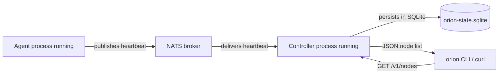

# Installation

This document covers building OrionMesh from source, configuring auth, and running the controller + agents either for local dev or as long-running services. For *what to do once it's running* see [usage.md](usage.md). For the broader picture see [architecture.md](architecture.md).

---

## 1. Prerequisites

| Component | Version | Notes |
|---|---|---|
| Rust toolchain | 1.87 or newer | Edition 2024. `rustup default stable` is enough. |
| NATS broker | 2.10+ with JetStream | Either the `nats:2.10` Docker image or a native install via `brew install nats-server`. JetStream must be enabled. |
| Docker (optional) | any recent | Convenient way to run NATS for dev; also needed once the Docker runtime adapter ships. |
| SQLite | bundled | `sqlx` ships its own SQLite — no system package required. |
| Build tools | platform default | `cc` (Linux), Xcode CLT (macOS). |

OrionMesh agents cross-compile to:

| Target | Used on |
|---|---|
| `aarch64-unknown-linux-gnu` | Raspberry Pi 4 / 5 |
| `x86_64-unknown-linux-gnu` | Linux x86 boxes, GPU rigs |
| `aarch64-apple-darwin` | Apple Silicon Macs |
| `x86_64-apple-darwin` | Intel Macs |

You don't need cross-compilation set up for the host build — `cargo build` on each node is fine.

---

## 2. Get the source

```bash
git clone https://github.com/geekychris/orion_mesh.git
cd orion_mesh
```

---

## 3. Build

```bash
cargo build --workspace            # debug build, ~30s cold
cargo build --workspace --release  # optimised, slower
```

Resulting binaries live under `target/debug/` or `target/release/`:

```
orion-agent         # node agent — runs on every node
orion-controller    # mesh controller — runs on one node
orion                # CLI (note: binary name is `orion`, crate is orion-cli)
orion-ui            # tiny admin web UI
```

To confirm everything builds and tests pass before you go further:

```bash
cargo test --workspace
```

You should see ~74 tests passing across the libraries.

---

## 4. Configure the cluster token

OrionMesh uses a **single shared cluster token** for both NATS auth and HTTP bearer auth. Generate one and store it somewhere every node can read.

```bash
# Generate a random 32-byte token (hex)
openssl rand -hex 32 > /tmp/orion.token

# Or whatever your password manager prefers — must be the same string on every node.
```

The token is loaded by precedence (highest wins):

1. `ORION_AUTH_DISABLED=1` — **dev only**, skips auth entirely
2. `ORION_CLUSTER_TOKEN=<token>` env var
3. `$ORION_TOKEN_FILE` env var pointing at a file
4. `~/.config/orion/cluster.token`

Recommended for any real machine:

```bash
mkdir -p ~/.config/orion
cp /tmp/orion.token ~/.config/orion/cluster.token
chmod 600 ~/.config/orion/cluster.token
```

A missing or empty token (with `ORION_AUTH_DISABLED` unset) makes every component fail to start with `MissingToken` — fast feedback.

---

## 5. Start NATS

### 5.1 Docker (fastest)

```bash
docker run -d --rm \
  --name orion-nats \
  -p 4222:4222 -p 8222:8222 \
  nats:2.10 -js
```

Health: `curl http://127.0.0.1:8222/healthz` should return `{"status":"ok"}`.

### 5.2 Native install (macOS)

```bash
brew install nats-server
nats-server -js
```

### 5.3 Native install (Linux / Pi)

Grab the static binary from the NATS releases page and drop it under `/usr/local/bin/`. The systemd unit below covers running it.

```ini
# /etc/systemd/system/nats-server.service
[Unit]
Description=NATS Server
After=network.target

[Service]
ExecStart=/usr/local/bin/nats-server -js
Restart=on-failure
User=nats
Group=nats

[Install]
WantedBy=multi-user.target
```

```bash
sudo systemctl daemon-reload
sudo systemctl enable --now nats-server
```

---

## 6. Local dev — fastest path

Auth off, in-memory store, everything on one machine:

```bash
# Terminal 1 — controller
ORION_AUTH_DISABLED=1 \
ORION_STORE_PATH=sqlite::memory: \
  target/debug/orion-controller --bind 127.0.0.1:7878

# Terminal 2 — agent
ORION_AUTH_DISABLED=1 \
  target/debug/orion-agent --node-id dev-node --heartbeat-interval 2

# Terminal 3 — talk to it
curl http://127.0.0.1:7878/v1/nodes
```

Within a couple of seconds the agent's inventory should appear in `/v1/nodes`.

---

## 7. Production-ish single-host setup

Persistent SQLite, auth on, controller and one local agent on the same machine.

```bash
# State directory
sudo mkdir -p /var/lib/orion
sudo chown $(whoami) /var/lib/orion

# Controller (interactive)
ORION_CLUSTER_TOKEN=$(cat ~/.config/orion/cluster.token) \
ORION_STORE_PATH=/var/lib/orion/state.sqlite \
  target/release/orion-controller \
    --bind 0.0.0.0:7878 \
    --nats-url nats://127.0.0.1:4222

# Agent on the same host
ORION_CLUSTER_TOKEN=$(cat ~/.config/orion/cluster.token) \
  target/release/orion-agent \
    --node-id $(hostname -s) \
    --nats-url nats://127.0.0.1:4222
```

For permanent installs use the systemd / launchd units in the next section.

---

## 8. systemd unit (Linux)

```ini
# /etc/systemd/system/orion-controller.service
[Unit]
Description=OrionMesh controller
After=network.target nats-server.service
Wants=nats-server.service

[Service]
Type=simple
User=orion
Group=orion
EnvironmentFile=-/etc/orion/controller.env
Environment=ORION_TOKEN_FILE=/etc/orion/cluster.token
Environment=ORION_STORE_PATH=/var/lib/orion/state.sqlite
Environment=ORION_HTTP_BIND=0.0.0.0:7878
Environment=ORION_NATS_URL=nats://127.0.0.1:4222
ExecStart=/usr/local/bin/orion-controller
Restart=on-failure
RestartSec=2

[Install]
WantedBy=multi-user.target
```

```ini
# /etc/systemd/system/orion-agent.service
[Unit]
Description=OrionMesh agent
After=network.target nats-server.service
Wants=nats-server.service

[Service]
Type=simple
User=orion
Group=orion
EnvironmentFile=-/etc/orion/agent.env
Environment=ORION_TOKEN_FILE=/etc/orion/cluster.token
Environment=ORION_NATS_URL=nats://controller.local:4222
ExecStart=/usr/local/bin/orion-agent --node-id %H
Restart=on-failure
RestartSec=2

[Install]
WantedBy=multi-user.target
```

Setup:

```bash
sudo useradd -r -s /usr/sbin/nologin orion
sudo install -m 755 target/release/orion-controller /usr/local/bin/
sudo install -m 755 target/release/orion-agent /usr/local/bin/
sudo mkdir -p /etc/orion /var/lib/orion
sudo install -m 600 ~/.config/orion/cluster.token /etc/orion/cluster.token
sudo chown -R orion:orion /var/lib/orion /etc/orion

sudo systemctl daemon-reload
sudo systemctl enable --now orion-controller        # on the controller node
sudo systemctl enable --now orion-agent             # on every agent node
```

`%H` in the agent unit expands to the host's short name — keeps the `--node-id` stable across reboots.

---

## 9. launchd plist (macOS)

```xml
<!-- ~/Library/LaunchAgents/io.orion.agent.plist -->
<?xml version="1.0" encoding="UTF-8"?>
<!DOCTYPE plist PUBLIC "-//Apple//DTD PLIST 1.0//EN" "http://www.apple.com/DTDs/PropertyList-1.0.dtd">
<plist version="1.0">
<dict>
  <key>Label</key><string>io.orion.agent</string>
  <key>ProgramArguments</key>
  <array>
    <string>/usr/local/bin/orion-agent</string>
    <string>--node-id</string>
    <string>mac-studio</string>
  </array>
  <key>EnvironmentVariables</key>
  <dict>
    <key>ORION_TOKEN_FILE</key><string>/Users/chris/.config/orion/cluster.token</string>
    <key>ORION_NATS_URL</key><string>nats://controller.local:4222</string>
  </dict>
  <key>RunAtLoad</key><true/>
  <key>KeepAlive</key><true/>
  <key>StandardErrorPath</key><string>/usr/local/var/log/orion-agent.err</string>
  <key>StandardOutPath</key><string>/usr/local/var/log/orion-agent.out</string>
</dict>
</plist>
```

```bash
launchctl load ~/Library/LaunchAgents/io.orion.agent.plist
launchctl list | grep io.orion
```

---

## 10. Verify the install



Smoke test:

```bash
# Should return "ok"
curl http://controller.local:7878/health

# Should include every running agent's NodeInventory
curl -H "Authorization: Bearer $(cat ~/.config/orion/cluster.token)" \
     http://controller.local:7878/v1/nodes
```

A node appears within `heartbeat_interval` (default 5s) of agent startup; inventory is published once at connect time.

---

## 11. Troubleshooting

| Symptom | Likely cause | Fix |
|---|---|---|
| Controller/agent exits with `MissingToken` | No token configured | Set `ORION_CLUSTER_TOKEN`, drop a token file, or use `ORION_AUTH_DISABLED=1` for dev |
| Both processes start but `/v1/nodes` is empty | NATS unreachable, or auth mismatch (one side enforce, other disabled) | Confirm `nats-server -DV` shows the publish; check that both processes use the same token state |
| `Connection refused (os error 61)` on startup | NATS broker not yet listening | Wait a few seconds for `nats-server` to bind; in compose-style setups add a readiness probe |
| `401` on `/v1/nodes` | Bearer token wrong or missing | `curl -H "Authorization: Bearer <token>"` — must exactly match the controller's token |
| `200` on `/health` but `401` on `/v1/nodes` | Working as intended | `/health` is outside the auth layer for liveness probes |
| Agent publishes inventory but `/v1/nodes` still empty after a minute | Controller heartbeat/inventory subscriber crashed | Check controller log for `subscriber exited` WARN; restart controller |
| `unknown variant 'X'` from `orion validate` | `runtime.kind` or top-level `kind` typo | See valid kinds in [usage.md](usage.md) §3 |
| `sqlx::Error: database is locked` | Multiple controllers pointed at the same SQLite file | Run one controller per state file; SQLite is single-writer |

For deeper debugging, set `RUST_LOG=debug,async_nats=info` on the controller — `tracing-subscriber` is wired everywhere.
