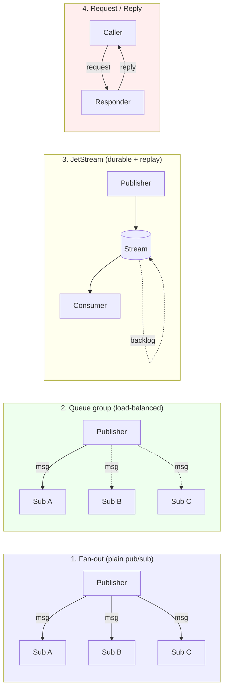
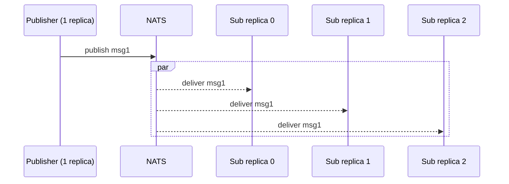
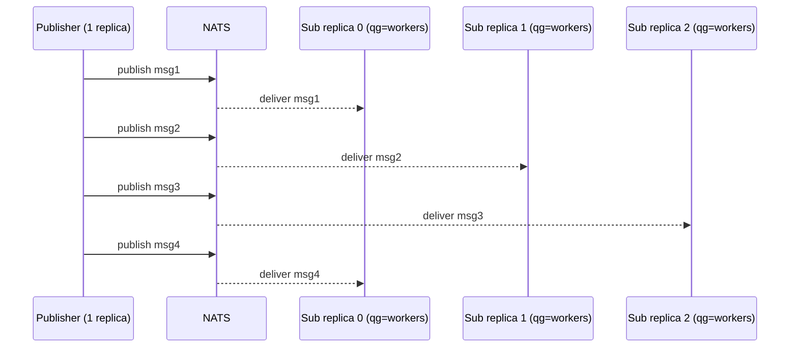
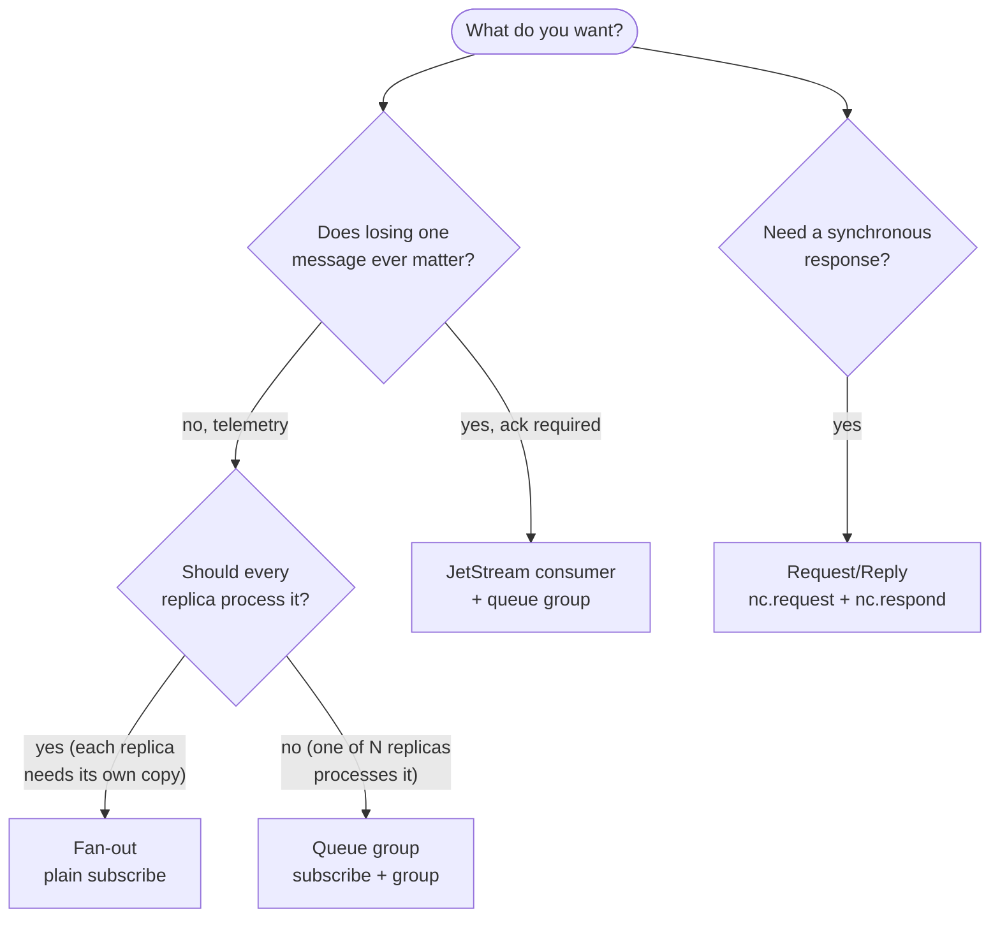

# IPC and Replicas

OrionMesh runs **one NATS broker** for the control plane (`orion.*` subjects). Your workloads can share that broker for their own data — different subject namespace, same wire. This doc explains the messaging patterns NATS offers, how OrionMesh's `replicas:` field interacts with each, and how to mix-and-match languages.

If you just want to run the examples, jump to [§4](#4-polyglot-end-to-end-demos). For the why-it's-built-this-way see [design.md](design.md).

---

## 1. Four patterns at a glance



| Pattern | What it does | When to use |
|---|---|---|
| **Fan-out** (`subscribe`) | Every subscriber on the subject gets every message | Broadcasting events; telemetry; cache-invalidation pings |
| **Queue group** (`queue_subscribe(subject, group)`) | Exactly one subscriber in the group gets each message | Worker pools; task queues; horizontal scaling consumers |
| **JetStream** | Durable, replayable, at-least-once delivery with acks | When losing a message is unacceptable; replay; persistent backlog |
| **Request/Reply** (`request`, `respond`) | Synchronous-feeling RPC over NATS | Cross-language remote calls without inventing an HTTP service |

These are NATS primitives. OrionMesh doesn't add or modify them — but its `replicas:` field interacts in different ways with each, which is the part that matters in practice.

---

## 2. How `replicas:` interacts with each pattern

When a Service has `replicas: N`, the agent receives one `ControlRun` envelope from the controller and **launches N copies of the workload**. Each replica:

- has its own `instance_id` (the 0-th reuses the controller-supplied id; siblings get fresh uuids)
- gets `ORION_REPLICA_INDEX = 0..N-1` and `ORION_REPLICA_COUNT = N` in its environment
- streams stdout/stderr back tagged with its `instance_id` and `replica_index`

What that means for your workload depends on how it talks to NATS:

### 2.1 With fan-out subscribers



**`N × work`** — every replica processes every message. Usually wrong for workers; usually right for telemetry/events/cache-busts where each replica needs its own copy of the world.

Example YAML — [`examples/09-ipc/fanout-3-replicas.yaml`](../examples/09-ipc/fanout-3-replicas.yaml).

### 2.2 With queue-group subscribers (recommended for workers)



**`1 × work, distributed across replicas`** — load-balanced. NATS picks one subscriber per message; over time work spreads roughly evenly (with some affinity bias toward fast/idle subscribers).

This is the **classic worker pool pattern**. Set `replicas: N`, have your workload `queue_subscribe(subject, queue_group)` with a fixed group name (typically the Service name), and you have a fleet of stateless workers consuming a shared queue.

Example YAML — [`examples/09-ipc/queue-group-3-workers.yaml`](../examples/09-ipc/queue-group-3-workers.yaml).

End-to-end demo (verified locally — 5 sent, 5 received, distribution `r0:1 / r1:1 / r2:3`):

```bash
curl -X POST --data-binary @examples/09-ipc/demo-pub.yaml                $CTRL/v1/resources/apply
curl -X POST --data-binary @examples/09-ipc/queue-group-3-workers.yaml   $CTRL/v1/resources/apply
curl -X POST $CTRL/v1/dispatch/Service/demo-sub-workers
curl -X POST $CTRL/v1/dispatch/Service/demo-pub
sleep 5
curl $CTRL/v1/logs/Service/demo-sub-workers | jq -r '.entries[].line' | grep recv \
  | sed -E 's/.*\[demo-sub:(r[0-9])\].*/\1/' | sort | uniq -c
#   2 r0
#   2 r1
#   1 r2
```

### 2.3 With replicas of the *publisher*

Most of the time you don't want N publishers — they all emit, the work multiplies. But there are legitimate cases:

- Each replica emits *different* data (each one owns a shard via `ORION_REPLICA_INDEX`).
- Each replica emits the same data deliberately (write-through redundancy across regions).
- N publishers + a queue group of M consumers → producer-side parallelism.

If you set `replicas: 3` on a publisher Service, the agent launches 3 copies. Each one has `ORION_REPLICA_INDEX=0/1/2`; the demo `orion-demo-pub` shows it in stdout as `r0`/`r1`/`r2`.

### 2.4 With JetStream consumers

JetStream is NATS's persistent + at-least-once layer. A *consumer* (in JetStream terminology) is durable; messages survive subscriber disconnects and get acked individually.

OrionMesh's control plane uses JetStream for the durable subjects (`orion.service.register`, `orion.task.events`, `orion.control.*` — see [architecture.md §4](architecture.md#4-nats-topic-map)). Your workloads can use it too:

- One consumer + N replicas (push-deliver to a queue group) → load-balanced with replay.
- Pull-based consumers → workers fetch when ready (good for slow, expensive work).

OrionMesh doesn't manage your JetStream streams for you today — you create them by talking to NATS directly. A `Stream` and `Consumer` resource kind that the controller provisions is later-phase scope.

### 2.5 With Request/Reply

Request/Reply uses ephemeral inboxes (`_INBOX.*`) under the hood, but the developer-facing API is synchronous:

```python
reply = await nc.request("orion.svc.upper", b"hello", timeout=2.0)
# reply.data == b"HELLO"
```

A `responder` service:

```python
async def handler(msg):
    await msg.respond(msg.data.upper())
await nc.subscribe("orion.svc.upper", queue="upper-workers", cb=handler)
```

If you put `replicas: N` on the responder Service **with a queue group**, you get a load-balanced RPC backend. Without the queue group, every replica responds to every request — and only the first response back wins.

---

## 3. Choosing a pattern



| You want… | Use | YAML pattern |
|---|---|---|
| Multiple workers share a queue | Queue group | `replicas: N` + `queue_subscribe(subject, group)` |
| Broadcast events to every replica | Fan-out | `replicas: N` + plain `subscribe` |
| Durable + replayable + ack-based | JetStream consumer | (workload calls `nc.jetstream()`; OrionMesh doesn't manage streams yet) |
| Synchronous RPC across languages | Request/Reply | Caller: `nc.request`; responder: `subscribe` + `msg.respond` |

---

## 4. Polyglot end-to-end demos

The same demo workloads (publish "tick N from `<label>` at HH:MM:SS.mmm" / receive and print) ship in three languages:

| Language | Source | Setup |
|---|---|---|
| Rust | [`crates/orion-demo-bins/`](../crates/orion-demo-bins/) | `cargo build --release -p orion-demo-bins` |
| Python | [`examples/09-ipc/polyglot/python/`](../examples/09-ipc/polyglot/python/) | `bash examples/09-ipc/polyglot/python/setup.sh` |
| Java | [`examples/09-ipc/polyglot/java/`](../examples/09-ipc/polyglot/java/) | `bash examples/09-ipc/polyglot/java/setup.sh` |

All three share an identical flag surface — `--subject`, `--queue-group`, `--interval`, `--label` — and all three respect `ORION_REPLICA_INDEX` for self-labeling when launched as replicas.

**Mixed interop demo** — 1 Python publisher feeds 3 Rust + 2 Java + 2 Python workers, all in the same `ipc-workers` queue group:

```bash
CTRL=http://127.0.0.1:7878

# Apply: one publisher (Python) + 7 workers across 3 languages
curl -X POST --data-binary @examples/09-ipc/polyglot/yaml/python-pub.yaml      $CTRL/v1/resources/apply
curl -X POST --data-binary @examples/09-ipc/queue-group-3-workers.yaml         $CTRL/v1/resources/apply  # 3 Rust
curl -X POST --data-binary @examples/09-ipc/polyglot/yaml/python-sub-qg.yaml   $CTRL/v1/resources/apply  # 2 Python
curl -X POST --data-binary @examples/09-ipc/polyglot/yaml/java-sub-qg.yaml     $CTRL/v1/resources/apply  # 2 Java

# Dispatch subs first
curl -X POST $CTRL/v1/dispatch/Service/demo-sub-workers   # 3 Rust replicas
curl -X POST $CTRL/v1/dispatch/Service/python-sub-qg       # 2 Python replicas
curl -X POST $CTRL/v1/dispatch/Service/java-sub-qg         # 2 Java replicas
sleep 1
curl -X POST $CTRL/v1/dispatch/Service/python-pub

# Watch all four streams
sleep 8
for s in demo-sub-workers python-sub-qg java-sub-qg python-pub; do
  echo "=== $s ==="
  curl -s $CTRL/v1/logs/Service/$s | jq -r '.entries[-3:][].line'
done
```

Each message published by `python-pub` goes to exactly *one* of the seven worker processes (3 Rust + 2 Python + 2 Java). With 1-second publish interval, each replica's stdout shows roughly N/7 messages over time — the broker doesn't know or care what language is on the other end.

---

## 5. Things to know

### 5.1 Subject namespaces

OrionMesh reserves `orion.*` for its control plane (see [`crates/orion-bus/src/topics.rs`](../crates/orion-bus/src/topics.rs)). Your workloads should publish/subscribe on *other* subjects — `app.events.*`, `tenant.<id>.work`, whatever your conventions are. The demos use `orion.demo.ipc` because they're owned by the mesh project; in your own code, pick a namespace that's yours.

### 5.2 Authentication

Today the mesh uses `ORION_CLUSTER_TOKEN` for connection auth (see [usage.md §5](usage.md#5-http-api)). Workloads launched by an agent inherit no NATS credentials by default — they connect as anonymous. In an auth-enforced cluster, pass the token via env in your YAML:

```yaml
runtime:
  kind: native
  exec: target/release/orion-demo-pub
  env:
    NATS_URL: nats://127.0.0.1:4222
    NATS_TOKEN: "${ORION_CLUSTER_TOKEN}"   # supply via the agent's env
```

(The agent doesn't yet do `${}` expansion — pass the literal token. Phase-5 reconciler work resolves this with secret refs.)

### 5.3 Subject discovery

There's no central subject registry yet. Today you coordinate by convention — document subjects in your repo's README. A `Capability` resource declaring `protocol: nats` and `subject: <name>` is the right shape; the Find API (Phase 4) will use this to advertise subjects across the fleet.

### 5.4 Wire format

NATS payloads are opaque bytes. Pick a serialization (JSON, MessagePack, Protobuf, Cap'n Proto, raw bytes) and stick with it across your producer/consumer pair. The demo uses plain UTF-8 strings.

### 5.5 Backpressure

NATS Core doesn't queue messages for slow subscribers — if a subscriber falls behind beyond NATS's internal buffer (~64MB by default), the broker disconnects it. For workloads that can't drop messages, use JetStream.

### 5.6 Replicas + restart_policy

`restart_policy: always` keeps each replica respawning if it crashes. `on_failure` restarts only on non-zero exit. `never` lets it die. The 0-th replica's `instance_id` is the controller-allocated one (echoed back in `POST /v1/dispatch` response); siblings get fresh ids per launch. Today the agent doesn't auto-restart — that's the Phase-5 reconciler — but the field is recorded for when it does.

---

## 6. Try all three, side-by-side

The Rust / Python / Java demos all expose the same flag surface so you can mix and match. Verified end-to-end recipes for each mode:

### 6.1 Fan-out (`subscribe`, no queue group)

3 replicas; **each receives every message**.

```bash
CTRL=http://127.0.0.1:7878
curl -X POST --data-binary @examples/09-ipc/fanout-3-replicas.yaml $CTRL/v1/resources/apply
curl -X POST --data-binary @examples/09-ipc/demo-pub.yaml          $CTRL/v1/resources/apply
curl -X POST $CTRL/v1/dispatch/Service/demo-sub-fanout
sleep 1
curl -X POST $CTRL/v1/dispatch/Service/demo-pub
sleep 6
curl $CTRL/v1/logs/Service/demo-sub-fanout | jq -r '.entries[].line' | grep recv \
  | sed -E 's/.*\[demo-sub:(r[0-9])\].*/\1/' | sort | uniq -c
# → 7 r0
#   7 r1
#   7 r2   (each replica got the same number → fan-out)
```

### 6.2 Queue group (`queue_subscribe`, ephemeral)

3 replicas, **load-balanced**; one of them processes each message.

```bash
curl -X POST --data-binary @examples/09-ipc/queue-group-3-workers.yaml $CTRL/v1/resources/apply
curl -X POST --data-binary @examples/09-ipc/demo-pub.yaml              $CTRL/v1/resources/apply
curl -X POST $CTRL/v1/dispatch/Service/demo-sub-workers
sleep 1
curl -X POST $CTRL/v1/dispatch/Service/demo-pub
sleep 6
curl $CTRL/v1/logs/Service/demo-sub-workers | jq -r '.entries[].line' | grep recv \
  | sed -E 's/.*\[demo-sub:(r[0-9])\].*/\1/' | sort | uniq -c
# → 2 r0
#   2 r1
#   1 r2   (≈ 5 total → exactly the pub count; spread across workers)
```

### 6.3 JetStream durable consumer

Persistent + at-least-once + replayable. Same shape as queue group but the messages survive subscriber restarts.

```bash
curl -X POST --data-binary @examples/09-ipc/jetstream/js-pub.yaml          $CTRL/v1/resources/apply
curl -X POST --data-binary @examples/09-ipc/jetstream/js-sub-workers.yaml  $CTRL/v1/resources/apply
curl -X POST $CTRL/v1/dispatch/Service/js-sub-workers
sleep 1
curl -X POST $CTRL/v1/dispatch/Service/js-pub
sleep 10
curl $CTRL/v1/logs/Service/js-sub-workers | jq -r '.entries[].line' | grep "recv (seq="
# → [demo-sub:r0] recv (seq=1): tick 1 from r0 at … (subject=orion.demo.js.tick)
# → [demo-sub:r1] recv (seq=2): tick 2 from r0 at …
# → …
```

To demo **replay**: kill a subscriber while the publisher keeps running, then restart it — JetStream will replay every unacked message. See [`examples/09-ipc/jetstream/README.md`](../examples/09-ipc/jetstream/README.md) for the full recipe.

### 6.4 Polyglot mix-and-match

All three languages honour the same flag surface — drop in a Java publisher in place of the Rust one, or run all three subscribers (Rust + Python + Java) against the same stream with different `--durable` names:

```bash
# Java publishes; Rust + Python each have their own durable consumer
java -jar examples/09-ipc/polyglot/java/target/orion-demo-js-pub.jar \
    --stream ORION_DEMO_JS --subject orion.demo.js --interval 0.5 &

./target/release/orion-demo-sub --jetstream --stream ORION_DEMO_JS \
    --subject orion.demo.js --durable rust-sub &

examples/09-ipc/polyglot/python/.venv/bin/python3 \
    examples/09-ipc/polyglot/python/js_sub.py \
    --stream ORION_DEMO_JS --subject orion.demo.js --durable py-sub &
```

Both subscribers see the exact same `seq` numbers and bodies (verified locally — Java pub → Rust + Python subs both got seq=10/11/12/13).

---

## 7. Behavioural summary

| | Fan-out | Queue group (core) | JetStream durable |
|---|---|---|---|
| Pub-side write | `nc.publish` | `nc.publish` | `js.publish` (returns ack with seq) |
| Sub-side bind | `subscribe(subject)` | `queue_subscribe(subject, group)` | `js.pull_subscribe(subject, durable=name, stream=stream)` |
| Delivery if no sub | dropped | dropped | retained on broker |
| Delivery if sub restarts | misses gap | misses gap | replays from last acked seq |
| Per-msg ack required | no | no | **yes** (`msg.ack()`) |
| N replicas with same logic | each gets ×N work | shared, ≈ 1/N each | shared via durable, ≈ 1/N each |
| Disk I/O cost | none | none | per-message persist |
| Use when | broadcast, telemetry, cache-bust | stateless worker pool | order/business events, replay needed |

---

## 8. What's still not here (yet)

- **A `Stream` / `Consumer` resource kind** so OrionMesh provisions JetStream for you (today: the publisher binary auto-creates the stream; idempotent).
- **A `Subject` discovery API** — Find subjects by capability across the fleet.
- **Secret-ref expansion** in env vars (`${vault:nats-token}`).
- **Replica-aware scheduling** — today all N replicas land on the same node; Phase 5 will spread them.

For the design rationale see [design.md](design.md). For the runnable examples see [examples.md](examples.md).
