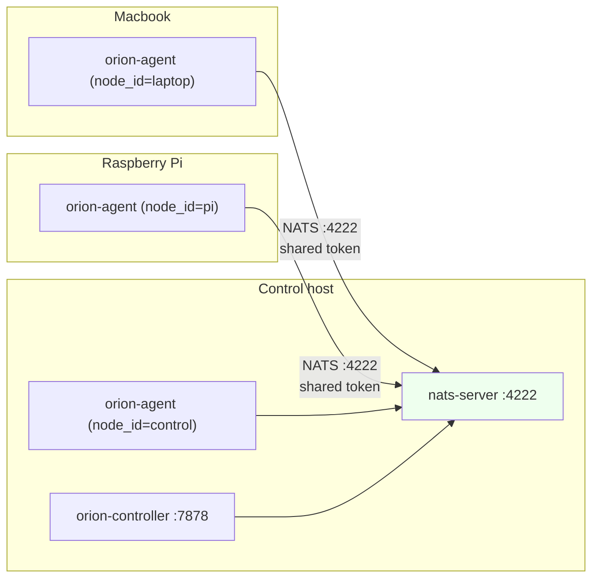

# Multi-host operation

OrionMesh's substrate has been multi-host capable since Phase 1 — the
hybrid NATS bus, shared cluster token, and inventory plumbing don't
care whether agents live on the same machine as the controller. The
defaults just bind to `127.0.0.1` for safety. This page covers turning
that into a real cluster.

## Topology



The broker is the only piece every node has to reach over the network.
Agents publish heartbeats + inventory + logs to NATS; the controller
subscribes and serves HTTP. The HTTP API itself only needs to be
reachable from clients (CLI / UI), not from agents.

## What's needed on each box

| Host | Binaries | Notes |
|---|---|---|
| Control host | `nats-server`, `orion-controller`, `orion-agent` (optional) | The agent is optional here — useful for running workloads on the same machine that orchestrates |
| Worker (Mac/Linux/Pi) | `orion-agent` | That's it. No controller, no broker |
| Client (any) | `orion` (the CLI) | Hits `ORION_CONTROLLER_URL` |

`scripts/install-bins.sh --with-nats` installs every binary you need
to `~/.orion/bin/` and (on the control host) the native `nats-server`
binary. On a worker, run it with `--no-nats` (still pulls down the
other binaries; the agent binary is the only one you'll actually use).

## The three things to change vs single-host

1. **Bind the broker to a real interface.** Default is loopback only.
   Set NATS to listen on `0.0.0.0` (or a specific interface) so other
   hosts can reach it.
2. **Set `NATS_URL` on the agents** to point at the control host.
3. **Use a real cluster token** instead of `ORION_AUTH_DISABLED=1`.

Defaults are dev-friendly; production needs all three flipped.

## Recipe — three hosts, native NATS

### Control host

```bash
# Generate a long random token once, share it with every host out of band
# (1Password, a secret manager, scp, whatever). NEVER commit it.
TOKEN=$(openssl rand -base64 32)
mkdir -p ~/.config/orion
echo "$TOKEN" > ~/.config/orion/cluster.token
chmod 600 ~/.config/orion/cluster.token

# Bind nats-server on all interfaces with token auth
nats-server -js --addr 0.0.0.0 -p 4222 --auth "$TOKEN" &

# Controller — token-enforced
ORION_CLUSTER_TOKEN="$TOKEN" \
    ORION_STORE_PATH="$HOME/.config/orion/orion.db" \
    orion-controller --bind 0.0.0.0:7878 &

# Optional: also run an agent here
ORION_CLUSTER_TOKEN="$TOKEN" \
    orion-agent --node-id $(hostname) --heartbeat-interval 5 &
```

### Worker (Mac / Linux / Pi)

```bash
# After scp'ing ~/.config/orion/cluster.token from the control host
NATS_URL="nats://CONTROL_HOST:4222" \
    ORION_CONTROLLER_URL="http://CONTROL_HOST:7878" \
    ORION_CLUSTER_TOKEN="$(cat ~/.config/orion/cluster.token)" \
    orion-agent --node-id $(hostname) --heartbeat-interval 5 &
```

### Client (any host with network reach)

```bash
ORION_CONTROLLER_URL="http://CONTROL_HOST:7878" \
    ORION_CLUSTER_TOKEN="$(cat ~/.config/orion/cluster.token)" \
    orion get nodes
```

You should see every running agent listed with its arch / OS / last
heartbeat. The controller will pick a node per dispatch using the
scheduler (`orion-scheduler::pick_best`) — placement constraints,
soft preferences, and load all factor in.

## Verifying it actually works

```bash
# from the client host
orion get nodes                                      # see all three?
orion doctor                                         # all green?
orion dispatch Service some-workload                 # dispatched to which one?
orion logs Service some-workload --follow            # logs flow back
```

To force a specific node, use placement:

```yaml
spec:
  placement:
    node_labels: { host: pi }
  runtime: { kind: native, exec: /usr/bin/uptime }
```

Apply this and the agent on `pi` is the only candidate, so the
scheduler picks it.

## Common gotchas

- **Firewall on port 4222.** Both directions. Workers initiate
  outbound to NATS; that's normally enough. If anything blocks it,
  the heartbeat won't land and `orion get nodes` will be empty.
- **NTP drift.** The reconciler treats a node as dead after 30s of
  silence. If the worker's clock skews wildly past the controller's,
  expect strange "dispatched but nothing happened" symptoms.
- **Token file permissions.** `chmod 600 ~/.config/orion/cluster.token`
  on every host. If anyone else can read it, anyone else can dispatch
  to your cluster.
- **Hostnames vs node-ids.** The `--node-id` flag is just a string —
  any unique identifier works. Hostnames are conventional but if two
  Macs are both called `macbook.local` you'll have a problem.
  `--node-id $(hostname)-$(uuidgen | head -c 4)` is a quick fix.
- **JetStream state on the broker.** If you restart `nats-server`
  without `-sd <dir>`, all your queue state vanishes (it lives in
  `/tmp`). Set `-sd ~/.config/orion/jetstream` for persistence across
  restarts.

## Cross-architecture in practice

`placement.arch` and `placement.os` are the typical levers:

```yaml
spec:
  placement:
    arch: [arm64]              # Pi or Apple Silicon
    os:   [linux]              # Pi only
```

For Apple Silicon Mac vs Linux on the same arch:

```yaml
spec:
  placement:
    arch: [arm64]
    os: [macos]                # Macbook only
    node_labels: { gpu: metal }    # if you label the Mac with this
```

The agent doesn't auto-label — you pass `--label k=v` on agent
startup, or set them via the resource model with `kind: Node` and a
labels block.

## Running as a system service

For production, run each binary under launchd (macOS) or systemd
(Linux) so they survive reboots. A starter unit lives at
[`installation.md`](installation.md#systemd-launchd-units).

## See also

- [`installation.md`](installation.md) — non-distributed install + auth setup
- [`runtime.md`](runtime.md) — what the agent will and won't run today
- [`debugging.md`](debugging.md) — "agents=0" / "dispatch doesn't reach the agent" recipes
