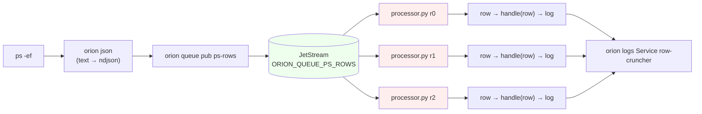

# Quickstart — process CLI output with a Python service

A complete 5-minute walkthrough. You'll pipe `ps -ef` through OrionMesh's
ndjson parser into a named queue, watch a 3-replica Python service consume
the rows, then tear it all down. No Docker. No YAML files on disk. No
scripts.

What you'll end up with:



A **work** queue, three Python replicas sharing one durable consumer
group, every row processed by exactly one of them.

> **Runnable.** `scripts/run-md.py docs/quickstart.md` walks every block
> in this doc end-to-end. The `{teardown}` block always runs last, so
> you're left in a clean state even if something fails partway through.

## 0 · Install (one time)

```bash {name=install skip}
cd ~/code/orion_mesh                              # or wherever you cloned it
./scripts/install-bins.sh --with-nats             # builds orion + downloads native nats-server
bash examples/10-queues/python/setup.sh           # creates the venv used by the processor
```

Tagged `{skip}` so re-runs don't recompile every time. Drop the
`{skip}` (or run by hand) on first use.

## 1 · Start the stack

```bash {name=up}
# Background — the runner's per-block shell tears this down at the end.
orion up --nats native --no-ui &
UP_PID=$!
# Wait for the broker, controller, and agent to all come up.
for i in 1 2 3 4 5 6 7 8 9 10; do
    sleep 1
    if orion doctor --no-fail --no-nats 2>/dev/null | grep -q "agents       /v1/nodes → 1"; then
        echo "stack ready after ${i}s"; break
    fi
done
orion doctor
```

`orion up` is a single command that:

- launches `nats-server` natively if it's on PATH (no Docker — see
  [`docs/runtime.md`](runtime.md))
- launches `orion-controller` (HTTP API on `:7878`)
- launches `orion-agent` (heartbeats + workload launcher)
- forwards everyone's stdout/stderr through one tagged stream
- kills the lot on Ctrl-C

`orion doctor` is the standard "is anything broken?" probe — broker /
controller / agents / JetStream. Always green here means we're ready
for work.

## 2 · Declare the queue

```bash {name=queue}
orion gen queue ps-rows --type work --max-age 1h | orion apply -f -
orion queue ls
```

`orion gen queue …` emits this YAML and pipes it to `orion apply`:

```yaml
apiVersion: orionmesh.dev/v1
kind: Queue
metadata: { name: ps-rows }
spec:
  type: work               # one row → one consumer (load-balanced)
  max_age_seconds: 3600    # JetStream drops messages older than 1h
```

A **`work`** queue means consumers sharing a durable name share the
work. (The alternative is `--type topic` — every consumer sees every
message; useful for monitors. See [`docs/queues.md`](queues.md).)

The subject is `orion.queue.ps-rows`. The JetStream stream is
`ORION_QUEUE_PS_ROWS`. Both auto-derived from the queue name, both
overridable in the spec.

## 3 · Define the processor (the Python service)

```bash {name=processor}
orion gen processor row-cruncher \
    --queue ps-rows --lang python --replicas 3 --group crunchers \
    --env PATH="$PWD/examples/10-queues/python/.venv/bin:$PATH" \
    --env PYTHONUNBUFFERED=1 \
    --template "$PWD/examples/10-queues/python/processor.py" | \
  orion apply -f -
```

That generates and applies a `Service` resource pointed at the
reference Python processor:

```yaml
apiVersion: orionmesh.dev/v1
kind: Service
metadata:
  name: row-cruncher
  labels: { role: processor, queue: ps-rows, lang: python }
spec:
  replicas: 3                       # three workers, will share the work
  restart_policy: on_failure
  runtime:
    kind: native                    # plain `python …` — no Docker
    exec: python
    args:
      - /…/examples/10-queues/python/processor.py
    env:
      NATS_URL:            nats://127.0.0.1:4222
      ORION_QUEUE_NAME:    ps-rows
      ORION_QUEUE_SUBJECT: orion.queue.ps-rows
      ORION_QUEUE_STREAM:  ORION_QUEUE_PS_ROWS
      ORION_QUEUE_TYPE:    work
      ORION_QUEUE_GROUP:   crunchers       # shared durable → load balancing
      PATH:                <venv>/bin:$PATH
      PYTHONUNBUFFERED:    "1"
```

The processor reads everything from env — there's no command-line
plumbing to remember. `--group crunchers` is the durable name; all
three replicas share it.

The reference `processor.py` is generic infrastructure (connect,
ensure stream, durable subscribe, ack on success, nak on exception).
The one function you'd normally edit is `handle(row)` — see
[§7](#7--customise-handlerow) below.

## 4 · Dispatch + verify

```bash {name=dispatch}
orion dispatch Service row-cruncher
sleep 4
orion instances Service row-cruncher
orion logs Service row-cruncher | head -10
```

You should see three instances (`replica` 0/1/2), all on the
`local-dev` node, plus startup banners:

```
[ps-rows#r0] starting — type=work subject=orion.queue.ps-rows stream=ORION_QUEUE_PS_ROWS group=crunchers
[ps-rows#r1] starting — type=work subject=orion.queue.ps-rows stream=ORION_QUEUE_PS_ROWS group=crunchers
[ps-rows#r2] starting — type=work subject=orion.queue.ps-rows stream=ORION_QUEUE_PS_ROWS group=crunchers
[ps-rows#r0] created stream ORION_QUEUE_PS_ROWS
[ps-rows#r1] bound to durable=crunchers
[ps-rows#r2] bound to durable=crunchers
…
```

The first replica to start creates the stream; the others get a
no-op `stream_info` hit and skip the create. All three then join the
`crunchers` durable.

## 5 · Pump CLI output through the pipeline

```bash {name=pump}
ps -ef | orion json --headers uid,pid,ppid,c,stime,tty,time,cmd | \
    orion queue pub ps-rows
```

What happens, left to right:

| Stage | What it does |
|---|---|
| `ps -ef` | dumps the process table as fixed-width columns |
| `orion json --headers uid,pid,…` | parses each row into a JSON object (one per stdout line) |
| `orion queue pub ps-rows` | reads ndjson stdin, publishes each line to `orion.queue.ps-rows` |

The header list is explicit here because `ps -ef`'s alignment trips
the column-autodetect on some macOS versions; for clean tabular tools
(`df`, `lsof`, etc.) you can omit `--headers` and let it autodetect.

## 6 · Verify the load-balancing

```bash {name=verify}
sleep 3
echo "=== count processed per replica (should be roughly equal) ==="
orion logs Service row-cruncher | grep "processed" | \
    awk '{ for(i=1;i<=NF;i++) if($i ~ /\[ps-rows#r/) { print $i; break } }' | \
    sort | uniq -c

echo "=== queue state ==="
orion queue describe ps-rows
```

Expected (counts vary with how many processes you have):

```
=== count processed per replica (should be roughly equal) ===
  N [ps-rows#r0]
  N [ps-rows#r1]
  N [ps-rows#r2]
=== queue state ===
name:    ps-rows
type:    Work
…
messages: <total>
consumers: 1               # one durable shared by 3 replicas
```

Each row got delivered to **exactly one** replica because they share
the `crunchers` durable. Switch to `--type topic` (a separate queue)
to see broadcast behaviour instead.

## 7 · Customise `handle(row)`

Open `examples/10-queues/python/processor.py`. The only function
you'd typically edit:

```python
def handle(row: dict) -> None:
    """User-editable per-row handler. Replace with your own logic."""
    print(f"[{LABEL}] processed: {json.dumps(row, sort_keys=True)[:200]}", flush=True)
```

`row` is the parsed ndjson — every column from `orion json` is a
field (`uid`, `pid`, `cmd`, …) plus a `_subject` carrying the
JetStream subject the row arrived on.

For a more interesting demo — bucket rows by command basename:

```python
import os
from collections import Counter
_counts: Counter = Counter()

def handle(row: dict) -> None:
    cmd = row.get("cmd", "?")
    basename = os.path.basename(cmd.split()[0]) if cmd else "?"
    _counts[basename] += 1
    print(f"[{LABEL}] +1 {basename}  (running totals: {dict(_counts.most_common(5))})", flush=True)
```

Restart the service to pick up the change, then publish more rows:

```bash {name=restart skip}
orion restart service row-cruncher
sleep 2
ps -ef | orion json --headers uid,pid,ppid,c,stime,tty,time,cmd | orion queue pub ps-rows
sleep 3
orion logs Service row-cruncher | grep '+1' | tail -10
```

(Tagged `{skip}` — runs only when you take it.)

## 8 · Teardown

```bash {teardown}
orion delete service row-cruncher 2>/dev/null || true
orion delete queue ps-rows 2>/dev/null || true
# kill the `orion up &` from §1
if [ -n "${UP_PID:-}" ]; then kill -INT "$UP_PID" 2>/dev/null || true; fi
sleep 1
pkill -f orion-controller 2>/dev/null || true
pkill -f orion-agent 2>/dev/null || true
pkill -f nats-server 2>/dev/null || true
pkill -f 'examples/10-queues/python/processor.py' 2>/dev/null || true
echo "torn down"
```

Resources live in `sqlite::memory:` so the controller forgets them
the moment it exits — no leftover state. The `pkill` lines are
belt-and-braces for the case where Ctrl-C didn't reach a child.

## What you just learned

| Concept | Maps to |
|---|---|
| Named queue with declared semantics | the `Queue` kind ([`docs/queues.md`](queues.md)) |
| Work vs topic delivery | enforced by consumer durable name, not stream config |
| Native process execution | `kind: native` in the Service runtime ([`docs/runtime.md`](runtime.md)) |
| 3 replicas sharing a queue group | `--replicas 3 --group <name>` on `orion gen processor` |
| stdin → ndjson | `orion json` (column-header autodetect / `--delim` / `--regex`) |
| ndjson → JetStream | `orion queue pub <name>` |
| All boilerplate, none of the orchestration | the reference `processor.py` — you only touch `handle()` |

## Where to go next

- **Run this as a background service** — drop `&` from `orion up`, pop it
  into your terminal or `tmux`; the stack stays up until Ctrl-C.
- **Try `--type topic`** — every replica gets every row; useful for
  monitoring / fan-out. [`docs/queues.md`](queues.md).
- **Debug it** — switch one replica into `--debug --debug-suspend` and
  attach VS Code. [`docs/debugging-processors.md`](debugging-processors.md).
- **Scaffold your own processor project** — `orion init processor my-thing
  --queue my-queue --lang python|java|rust` creates a runnable project
  directory you can `git init` and develop independently.
- **Benchmark** — `orion bench queue ps-rows -n 10000 -s 1024` gives
  publish rate, end-to-end latency, p50/p95/p99.
- **Walk the other examples** — [`examples/09-ipc/README.md`](../examples/09-ipc/README.md)
  covers the lower-level NATS / JetStream patterns under the queue API.

## See also

- [`docs/queues.md`](queues.md) — the Queue kind in depth
- [`docs/runtime.md`](runtime.md) — why OrionMesh is native-first, what
  adapters exist, when (if ever) you'd want Docker
- [`docs/debugging.md`](debugging.md) — debug workloads, components, or
  live cluster state
- [`examples/10-queues/README.md`](../examples/10-queues/README.md) — the
  long-form walkthrough this quickstart distills
