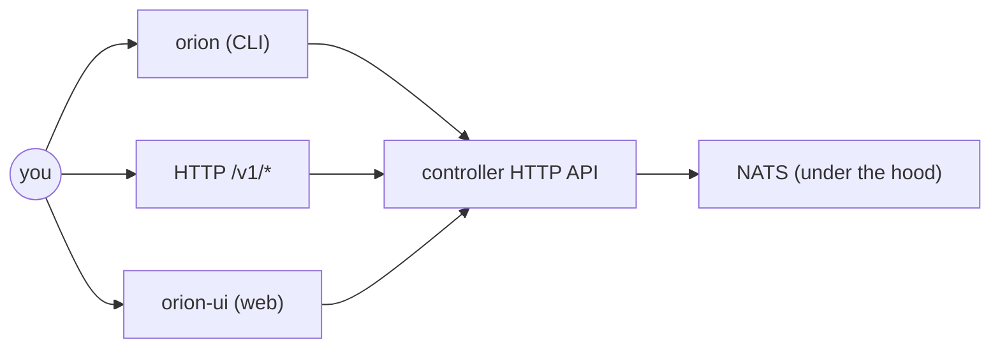
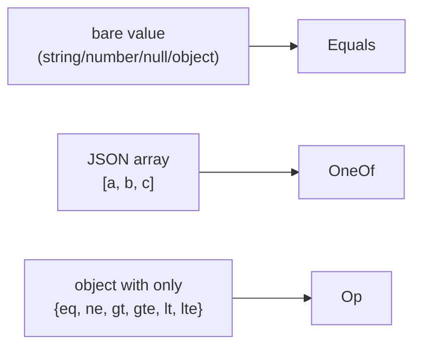
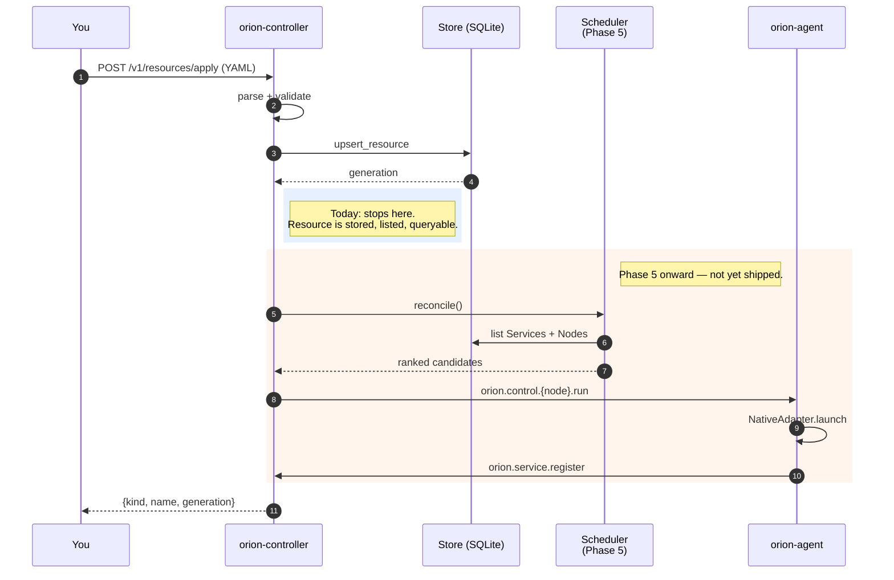
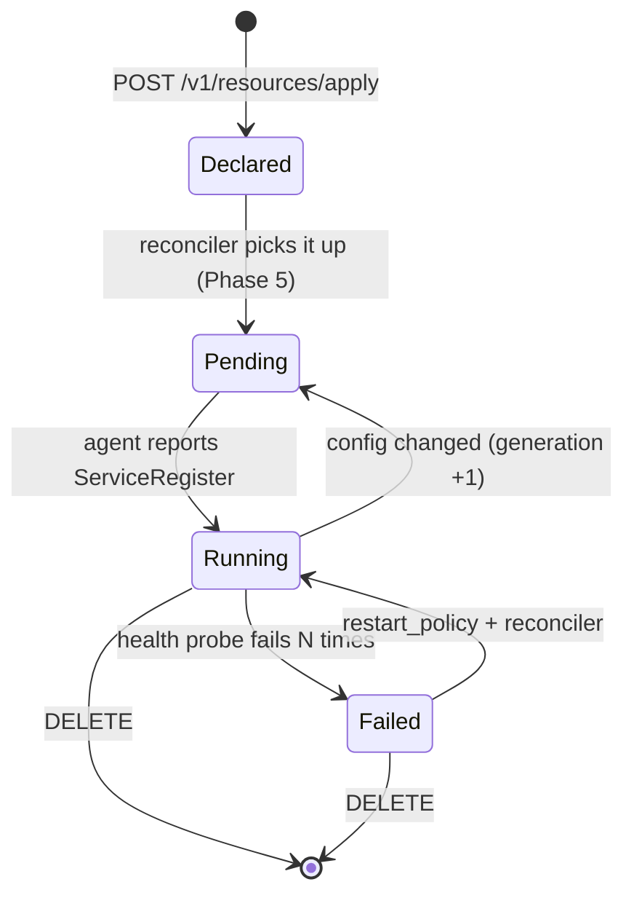

# Usage

How to actually use OrionMesh once it's installed. For setup see [installation.md](installation.md). For the system model see [architecture.md](architecture.md).

> **Phase 1 scope** — most of the resource model is parseable and persistable today, but only `Service` with a `native` runtime gets all the way to a launched process. Calling `orion apply` on the others stores the resource (and you can list it back) but the scheduler dispatch + non-native adapters land in later phases.

---

## 1. Surface map



You interact with the controller, not NATS or agents directly. The CLI just wraps `curl`-style calls.

---

## 2. The CLI

The CLI binary is `orion` (from the `orion-cli` crate).

```bash
orion --help
```

Today's commands:

| Command | What it does |
|---|---|
| `orion validate <file.yaml>` | Parse the file into a `Resource`, run semantic checks, print kind+name. No controller call. |
| `orion get nodes` | `GET /v1/nodes` |

Planned (Phase 1+):

| Command | Status |
|---|---|
| `orion apply -f <file>` | Phase 1, near-term (already supported as `POST /v1/resources/apply`) |
| `orion get services / tasks / capabilities` | Phase 3 |
| `orion delete -f <file>` | Phase 5 |
| `orion logs service/<name>` | Phase 3 |
| `orion run -f task.yaml` | Phase 3 |
| `orion find capability <cap> attr=value` | Phase 4 |

### Pointing the CLI at a remote controller

```bash
ORION_CONTROLLER_URL=https://controller.belmont.local:7878 orion get nodes
```

When auth is enforced, also pass the token. (CLI bearer handling is on the near-term punch list — for now, use `curl` with a bearer header.)

---

## 3. Authoring resources

Every desired-state document has the same four-block layout:

```yaml
apiVersion: orionmesh.dev/v1   # defaulted if omitted
kind: <Kind>
metadata:
  name: <dns-1123 name>
  namespace: <optional>
  labels: { ... }
  annotations: { ... }
  generation: <optional, set by controller>
spec:
  # per-kind, see sections below
status:
  # observed; written by the controller, not the operator
```

`orion validate` parses the file and runs `Resource::validate()`. The validator catches things serde can't — e.g. a Schedule with neither `task:` nor `task_template:`.

### 3.1 Valid kinds

```
Node Service Task Job Schedule Dataset Model Project
Secret Volume Network Runtime Capability Policy Integration
```

If you misspell the kind, the parse error lists every valid alternative. Same for `runtime.kind`.

### 3.2 Service

Long-running workload. Reconciler keeps `replicas` instances of it healthy.

```yaml
apiVersion: orionmesh.dev/v1
kind: Service
metadata:
  name: amiga-search
  labels: { site: belmont }
spec:
  runtime:
    kind: docker
    image: amiga-search:latest
  replicas: 1
  placement:
    arch: [arm64, x86_64]
    os: [linux]
  requires:
    search:
      dataset: amiga_schematics
  capabilities:
    - name: search
      attributes:
        dataset: amiga_schematics
        protocol: http
  ports:
    - { name: http, port: 8080 }
    - { name: metrics, port: 9090 }
  health:
    kind: http
    path: /healthz
    port: 8080
    interval_seconds: 10
    failure_threshold: 3
  restart_policy: on_failure
```

### 3.3 Task

One-shot workload with retry semantics.

```yaml
kind: Task
metadata: { name: train-once }
spec:
  runtime: { kind: python, module: train, venv: ./.venv }
  placement:
    gpu: { vendor: nvidia, min_vram_gb: 24 }
    acceleration: cuda
  prefer_data_locality: true
  timeout_seconds: 7200
  retry: { max_attempts: 3, backoff_seconds: 60 }
```

`prefer_data_locality: true` tells the scheduler to score nodes that already hold a referenced Dataset higher.

### 3.4 Schedule

Cron-fires a Task. Either reference a Task by name *or* inline a template — not both.

```yaml
kind: Schedule
metadata: { name: nightly-train }
spec:
  cron: "0 2 * * *"
  task: train-once       # mutually exclusive with task_template
# or:
# spec:
#   cron: "0 2 * * *"
#   task_template:
#     runtime: { kind: native, exec: /usr/local/bin/snapshot }
```

### 3.5 Dataset

Tells OrionMesh where data lives. Used for capability-aware scheduling and `find dataset`.

```yaml
kind: Dataset
metadata: { name: amiga-schematics }
spec:
  locations:
    - { node: pi5, path: /data/amiga, access: ro }
    - { node: mac-studio, path: /Volumes/data/amiga, access: rw }
  formats: [pdf, png]
  capabilities: [search]
  size_bytes: 12345678
```

`access` is one of `ro`, `rw`, `wo`.

### 3.6 Model

LLM / ONNX / MLX models with variant-level resource hints.

```yaml
kind: Model
metadata: { name: qwen-coder }
spec:
  model_id: qwen2.5-coder-32b
  variants:
    - { format: gguf, quant: q4_k_m, memory_gb: 22.0, context_window: 32768, preferred_runtime: "llama.cpp" }
    - { format: mlx,  quant: int8,   memory_gb: 36.0, context_window: 32768, preferred_runtime: mlx }
  served_by: [mac-studio]
```

The scheduler will pick a variant whose `memory_gb` fits the candidate node.

### 3.7 Node (declarative side)

You can declare a node ahead of time. The agent's observed inventory always wins for liveness, but the declared form is useful for asserting roles or labels.

```yaml
kind: Node
metadata: { name: gpu-rig }
spec:
  node_id: gpu-rig
  roles: [worker, llm]
  arch: x86_64
  os: linux
  gpus:
    - { vendor: nvidia, vram_gb: 24, name: "RTX 4090" }
  acceleration: cuda
  resources: { cpu_cores: 16, memory_gb: 64 }
  runtimes: [native, docker, python, llm]
  labels: { site: belmont, power: mains }
```

### 3.8 Runtime (peer catalog)

Registers an external runtime system (OrionMesh in another site, KQueue, …) so workloads can declare `runtime: { kind: peer, system: <name>, ref: <id> }`.

```yaml
kind: Runtime
metadata: { name: orionmesh-belmont }
spec:
  runtime_kind: orionmesh
  base_url: "http://controller.belmont.local:7878"
  admin_ui_url: "http://controller.belmont.local:7879"
  config:
    natsUrl: "nats://nats.belmont.local:4222"
```

### 3.9 Capability (declared schema)

Optional — declares the attribute shape of a capability so other consumers can validate selectors.

```yaml
kind: Capability
metadata: { name: search }
spec:
  capability: search
  description: "Full-text or vector lookup over a dataset"
  attribute_schema:
    type: object
    properties:
      dataset: { type: string }
      protocol: { type: string, enum: [http, grpc] }
```

### 3.10 Secret, Volume, Network

Smaller stubs:

```yaml
kind: Secret
metadata: { name: openai-api-key }
spec:
  vault_ref: "plaintext://openai-api-key"
---
kind: Volume
metadata: { name: scratch }
spec: { path: /mnt/scratch, mounted_on: [mac-studio], size_gb: 500 }
---
kind: Network
metadata: { name: belmont }
spec: { cidr: 10.10.0.0/16, sites: [belmont] }
```

---

## 4. Placement and capability selectors

This is where OrionMesh diverges from a generic orchestrator. You can constrain placement on hardware *and* on advertised capabilities.

### 4.1 Hard constraints

```yaml
placement:
  arch: [arm64, x86_64]            # ANY-of
  os: [linux]                       # ANY-of
  gpu: { vendor: nvidia, min_vram_gb: 24 }
  acceleration: cuda
  node_labels: { site: belmont }    # ALL-of (key must match value)
```

Empty placement = matches anything.

### 4.2 Soft preferences (scoring — Phase 5)

```yaml
placement:
  arch: [arm64, x86_64]
  prefer:
    node_labels: { power: mains }   # bonus points for mains-powered
    data_locality: true             # bonus points for nodes that hold the dataset
```

### 4.3 Capability requirements

Reuses the same JSON-ish shape that services advertise. Each requirement is `capability → { attr: AttrMatch }`.

```yaml
requires:
  llm:
    model: qwen-coder
    gpu:
      min_vram_gb: { gte: 24 }      # Op form
  search:
    dataset: amiga_schematics       # Equals (bare value)
    format: [pdf, png]              # OneOf (array)
```

Three forms of attribute match — picked by JSON shape:



`Op` lets you write `{ gte: 24 }`, `{ lt: 100, gt: 0 }`, etc. Everything else falls back to `Equals`.

---

## 5. HTTP API

Bearer auth required unless `ORION_AUTH_DISABLED=1` was set on the controller.

| Method + path | What it does |
|---|---|
| `GET /health` | Liveness probe (outside auth layer) |
| `GET /v1/nodes` | Observed node list — heartbeat + inventory |
| `GET /v1/resources/<Kind>` | List all resources of that kind |
| `POST /v1/resources/apply` | Upsert a single resource (YAML body) |

`GET /v1/resources/<Kind>/<name>`, `DELETE`, `POST /v1/find` come in Phase 3/4.

### 5.1 Examples

```bash
TOKEN=$(cat ~/.config/orion/cluster.token)
CTRL=http://controller.local:7878

# Health (no auth)
curl $CTRL/health

# Nodes
curl -H "Authorization: Bearer $TOKEN" $CTRL/v1/nodes

# Apply a service
curl -H "Authorization: Bearer $TOKEN" \
     -X POST --data-binary @amiga-search.yaml \
     $CTRL/v1/resources/apply
# → {"kind":"Service","name":"amiga-search","generation":1}

# Re-apply the same body — generation stays at 1
curl -H "Authorization: Bearer $TOKEN" \
     -X POST --data-binary @amiga-search.yaml \
     $CTRL/v1/resources/apply
# → {"kind":"Service","name":"amiga-search","generation":1}

# Change a field, re-apply — generation goes to 2
sed -i '' 's/replicas: 1/replicas: 2/' amiga-search.yaml
curl -H "Authorization: Bearer $TOKEN" \
     -X POST --data-binary @amiga-search.yaml \
     $CTRL/v1/resources/apply
# → {"kind":"Service","name":"amiga-search","generation":2}

# List Services
curl -H "Authorization: Bearer $TOKEN" $CTRL/v1/resources/Service
```

### 5.2 What `apply` does today vs. tomorrow



---

## 6. Resource lifecycle expectations



`status.phase` follows this state machine for Service and Task. Today only `Declared` is reachable for non-native runtimes.

---

## 7. Worked example: native sleep service

A minimal end-to-end. Assumes you've followed [installation.md §6](installation.md#6-local-dev--fastest-path) for local dev.

```bash
cat > /tmp/sleeper.yaml <<'EOF'
apiVersion: orionmesh.dev/v1
kind: Service
metadata: { name: sleeper }
spec:
  runtime:
    kind: native
    exec: /bin/sleep
    args: ["3600"]
  replicas: 1
  restart_policy: always
EOF

orion validate /tmp/sleeper.yaml
# → ok: kind=Service name=sleeper

curl -X POST --data-binary @/tmp/sleeper.yaml \
     http://127.0.0.1:7878/v1/resources/apply
# → {"kind":"Service","name":"sleeper","generation":1}

curl http://127.0.0.1:7878/v1/resources/Service
# → [ {apiVersion, kind: Service, metadata: { name: sleeper }, spec: { ... } } ]
```

Once the scheduler ships (Phase 5), this same YAML will result in a `/bin/sleep 3600` process running on a chosen node.

---

## 8. Working with peers

### 8.1 Register OrionMesh in Dev Portal

OrionMesh writes itself into the Dev Portal peer-runtime catalog so assets there can declare `this runs on OrionMesh`.

```bash
TOKEN=...
curl -X POST http://devportal.local:8081/api/peer-runtimes \
     -H "Content-Type: application/json" \
     -d '{
       "name": "orionmesh-belmont",
       "kind": "orionmesh",
       "baseUrl": "http://controller.belmont.local:7878",
       "adminUiUrl": "http://controller.belmont.local:7879",
       "config": { "natsUrl": "nats://nats.belmont.local:4222" }
     }'
```

Once registered, Dev Portal asset pages will deep-link / iframe the matching OrionMesh admin view.

### 8.2 Delegate a workload to KQueue

`runtime: peer` hands off to a peer system registered in Dev Portal.

```yaml
kind: Service
metadata: { name: ingest-worker }
spec:
  runtime:
    kind: peer
    system: kqueue-default
    ref: my-queue
```

OrionMesh's scheduler treats this like any other runtime; KQueue runs it.

---

## 9. Common pitfalls

| Symptom | Likely cause |
|---|---|
| `unknown variant 'X'` from validate | Typo in `kind:` or `runtime.kind:` — the error lists valid options |
| `schedule must set exactly one of task or taskTemplate` | Schedule has both set or neither — pick one |
| `Capability` matching unexpectedly | Selector is using `OneOf` when you meant `Equals` — `[a]` is `OneOf([a])`, not `Equals(a)` |
| Apply returns the same generation | Body is byte-identical to the stored body — change something to bump |
| Service not running yet | Scheduler dispatch is Phase 5; declared resources don't launch until then |
| 401 on `/v1/nodes` | Wrong bearer token or no header — `/health` does work unauthenticated |

For deeper triage see [installation.md §11](installation.md#11-troubleshooting).
