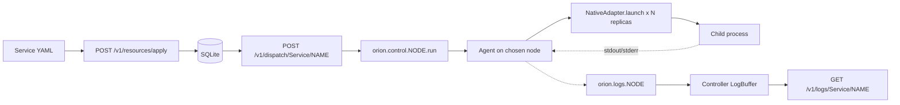

# 01 — Services

A **Service** in OrionMesh is a long-running workload — a daemon, an HTTP server, a queue worker, a message bus subscriber. The controller treats it as desired state: "keep N replicas of this alive". Unlike a [Task](../02-tasks/), a Service doesn't have a defined exit; you stop it explicitly when you don't want it any more.

> **Runnable.** `scripts/run-md.py examples/01-services/README.md` walks every recipe in this README end-to-end (with a `{teardown}` step at the end). See [`../docs/runner.md`](../docs/runner.md) for the tag conventions (`{name=X}`, `{skip}`, `{allow_fail}`, `{teardown}`) and the drive flags (`--list`, `--only X`, `--dry-run`, `--interactive`).

## Concept



What happens when you `apply` + `dispatch`:
1. The YAML is parsed via `Resource::from_yaml` and validated.
2. The body is stored in SQLite; `generation` bumps if the body changed.
3. On `dispatch`, the controller picks a node (today: most-recent live), publishes a `ControlRun` envelope on `orion.control.<node>.run`.
4. The agent receives it, calls `NativeAdapter.launch` (or whichever adapter matches `runtime.kind`), and pipes stdout/stderr back as `LogLine` envelopes on `orion.logs.<node>`.
5. The controller subscribes to logs and keeps a ring buffer; `GET /v1/logs/Service/<name>` reads from it.

## Service spec — every field

```yaml
apiVersion: orionmesh.dev/v1
kind: Service
metadata:
  name: my-service               # DNS-1123 name; primary key
  namespace: _                   # optional, default "_"
  labels: { tier: edge, app: web }
  annotations: { description: "..." }
  generation: 1                  # set by the controller; do not write
spec:
  runtime:                       # required — see "Runtimes" below
    kind: native | docker | python | java | node | spark | llm | homeassistant | wasm | peer
    # …runtime-specific fields…

  replicas: 1                    # how many copies; agent fans out N processes per dispatch

  placement:                     # see examples/05-placement/
    arch: [arm64, x86_64]        # ANY-of (lists are OR-d)
    os:   [linux, macos]
    gpu:  { vendor: nvidia, min_vram_gb: 24 }
    acceleration: cuda | metal | rocm | coreml | none
    node_labels: { site: belmont }   # ALL-of (kvs are AND-d)
    prefer:                      # soft scoring (Phase 5 scheduler reads this)
      node_labels: { power: mains }
      data_locality: true

  requires:                      # see examples/04-capabilities/
    <capability_name>:
      <attr>: <value>            # Equals (bare value)
      <attr>: [v1, v2]           # OneOf (array)
      <attr>: { gte: 24 }        # Op (eq/ne/gt/gte/lt/lte)

  capabilities:                  # what this service advertises
    - name: search
      attributes:
        dataset: amiga_schematics
        protocol: http

  ports:                         # named ports — service discovery (Phase 4) keys off these
    - { name: http,    port: 8080, protocol: tcp }
    - { name: metrics, port: 9090, protocol: tcp }

  health:                        # liveness probe; Phase-5 reconciler reads it
    kind: http | tcp | exec
    # HTTP form:
    path: /healthz
    port: 8080
    # TCP form:
    port: 6379
    # Exec form:
    command: ["/usr/local/bin/probe", "--quiet"]
    interval_seconds: 10         # default 10
    failure_threshold: 3         # default 3

  restart_policy: always | on_failure | never    # default "always"
```

### Runtimes

The `runtime` block is a discriminated union — `kind` picks the adapter and the rest of the fields belong to that variant:

```yaml
runtime: { kind: native, exec: /bin/sh, args: ["-c", "..."], env: { K: V } }
runtime: { kind: docker, image: nginx:alpine, args: [...], env: {...}, ports: [80] }
runtime: { kind: python, module: train,   venv: /opt/venvs/qwen, args: [...] }
runtime: { kind: java,   jar: /opt/x.jar, args: [...] }
runtime: { kind: node,   entry: server.js, args: [...] }
runtime: { kind: spark,  app: my-app.jar, args: [...] }
runtime: { kind: llm,    model: qwen-coder, backend: llama.cpp }
runtime: { kind: homeassistant, integration: zwave_js }
runtime: { kind: wasm,   module: /opt/x.wasm }
runtime: { kind: peer,   system: kqueue-default, ref: my-queue }
```

Only **native** has a working adapter today — Docker / Python / Java / Node / Spark / LLM land in Phase 5 alongside the full scheduler. `peer` delegates to a peer system registered in Dev Portal (see [07-peers](../07-peers/)). **OrionMesh is native-first by design** — see [`docs/runtime.md`](../../docs/runtime.md) for why, and for how to launch Python / Java / Rust workloads natively today (you wrap the interpreter or jar via `kind: native exec: python|java args: [...]` — both `examples/09-ipc/polyglot/` and `examples/10-queues/` do this).

## The four files

| File | What's distinctive |
|---|---|
| [`native-sleeper.yaml`](native-sleeper.yaml) | Minimal viable Service. One replica of `/bin/sleep 3600`. |
| [`docker-nginx.yaml`](docker-nginx.yaml) | Docker runtime, 2 replicas, named ports, HTTP health check, on-failure restart. Stored today; **dispatch needs Phase 5 Docker adapter**. |
| [`docker-redis.yaml`](docker-redis.yaml) | Docker runtime, env vars, TCP health check. Stored; dispatch needs Phase 5. |
| [`native-with-exec-health.yaml`](native-with-exec-health.yaml) | Native runtime + exec health probe. Dispatchable today; health probe loop is Phase 5. |

### `native-sleeper.yaml`

```yaml
runtime:
  kind: native
  exec: /bin/sleep
  args: ["3600"]
replicas: 1
restart_policy: always
```

The shortest legal Service. No placement, no health, no capabilities. Just "run `sleep 3600` somewhere". Useful as the "is my dispatch path working?" smoke test.

### `docker-nginx.yaml` (illustrative — not runnable yet)

```yaml
runtime: { kind: docker, image: nginx:1.27-alpine, env: { NGINX_HOST: example.local } }
replicas: 2
ports:
  - { name: http,    port: 80 }
  - { name: metrics, port: 9113 }
health:
  kind: http
  path: /
  port: 80
  interval_seconds: 5
  failure_threshold: 3
restart_policy: on_failure
placement:
  arch: [arm64, x86_64]
  os: [linux]
```

Demonstrates: Docker runtime, multi-replica, named ports (Phase-4 service discovery keys off `name`), HTTP health check, restart-on-failure, x86+ARM Linux placement.

### `docker-redis.yaml` (illustrative — not runnable yet)

```yaml
runtime:
  kind: docker
  image: redis:7-alpine
  args: ["--maxmemory", "256mb", "--maxmemory-policy", "allkeys-lru"]
  env: { REDIS_LOG_LEVEL: notice }
ports: [{ name: redis, port: 6379 }]
health: { kind: tcp, port: 6379, interval_seconds: 10 }
restart_policy: always
```

Docker runtime with passthrough args to the entrypoint, env vars, TCP health check.

### `native-with-exec-health.yaml`

```yaml
runtime:
  kind: native
  exec: /usr/local/bin/ledgerd
  args: ["--mode=sync"]
  env: { LEDGER_DB: /var/lib/ledger/db, RUST_LOG: info }
health:
  kind: exec
  command: ["/usr/local/bin/ledgerd-healthcheck", "--quiet"]
  interval_seconds: 15
  failure_threshold: 2
restart_policy: on_failure
placement: { os: [linux] }
```

Demonstrates: native runtime + exec health probe (the agent will run the command periodically, success = exit 0).

## Recipe — apply, dispatch, watch

```bash {name=build}
cargo build -p orion-cli
cargo build --release -p orion-controller -p orion-agent
```

```bash {name=validate-all}
# All four parse cleanly
for f in examples/01-services/*.yaml; do
  ./target/debug/orion validate "$f"
done
```

```bash {name=apply-native}
CTRL=${ORION_CONTROLLER_URL:-http://127.0.0.1:7878}
curl -sS -X POST --data-binary @examples/01-services/native-sleeper.yaml $CTRL/v1/resources/apply ; echo
```

```bash {name=dispatch-native}
CTRL=${ORION_CONTROLLER_URL:-http://127.0.0.1:7878}
curl -sS -X POST $CTRL/v1/dispatch/Service/sleeper ; echo
sleep 1
echo "=== instances tracked ==="
curl -s $CTRL/v1/instances/Service/sleeper | python3 -m json.tool 2>/dev/null | head -15 || true
```

A chattier Service so the logs panel has something interesting:

```bash {name=run-chatty}
CTRL=${ORION_CONTROLLER_URL:-http://127.0.0.1:7878}
curl -sS -X POST $CTRL/v1/resources/apply --data-binary @- <<'YAML' ; echo
apiVersion: orionmesh.dev/v1
kind: Service
metadata: { name: chatty }
spec:
  runtime:
    kind: native
    exec: /bin/sh
    args: ["-c", "for i in 1 2 3 4 5; do echo line-$i; sleep 1; done; echo done"]
  replicas: 1
  restart_policy: always
YAML
curl -sS -X POST $CTRL/v1/dispatch/Service/chatty ; echo
sleep 7
echo "=== chatty logs ==="
curl -s $CTRL/v1/logs/Service/chatty | python3 -c "
import sys, json
d = json.load(sys.stdin)
print(f'total={d[\"total\"]} lines:')
for e in d['entries']:
    print(f'  [{e[\"at\"][11:19]}] {e[\"stream\"]:6} {e[\"line\"]}')"
```

## Tear down

```bash {teardown}
CTRL=${ORION_CONTROLLER_URL:-http://127.0.0.1:7878}
for n in sleeper chatty web-frontend redis-cache ledger-daemon; do
  curl -sS -X DELETE $CTRL/v1/resources/Service/$n > /dev/null 2>&1 || true
done
pkill -f '01-services' 2>/dev/null || true
pkill -f 'chatty' 2>/dev/null || true
echo "service examples torn down"
```

## See also

- [`docs/usage.md §3.2`](../../docs/usage.md#32-service) — Service in the API/CLI guide
- [`docs/ipc.md`](../../docs/ipc.md) — how Services talk to each other (replicas × NATS modes)
- [`docs/architecture.md §6.3`](../../docs/architecture.md#63-direct-dispatch--stdoutstderr-capture-phase-a--live) — the exact dispatch+log sequence diagram
- [`examples/04-capabilities/`](../04-capabilities/) — to use the `capabilities:` block
- [`examples/05-placement/`](../05-placement/) — to use the `placement:` block
