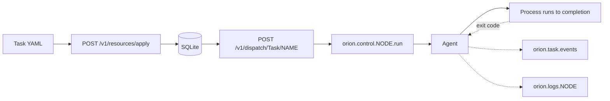

# 02 — Tasks

A **Task** is a *one-shot* workload — it runs to completion (zero or non-zero exit), and then it's done. Use Task for batch jobs, backups, migrations, training runs, or anything with a defined beginning and end. Use [Service](../01-services/) for things that should stay up.

> **Runnable.** `scripts/run-md.py examples/02-tasks/README.md` walks the recipes end-to-end and tears down. Tags: `{name=X}`, `{skip}`, `{allow_fail}`, `{teardown}`.

## Concept



Task vs Service differences:

| | Service | Task |
|---|---|---|
| Lifetime | Long — `restart_policy` keeps it alive | Short — runs to completion |
| `replicas:` | Meaningful — N copies kept healthy | Not meaningful (always 1) |
| `restart_policy:` | Honoured by the reconciler | Ignored (one-shot) |
| `retry:` | Not on this kind | Honoured — N attempts if non-zero exit |
| Typical NATS pattern | queue group subscriber | `nc.publish` then exit |
| Schedule integration | — | Fired by [Schedule resources](../03-schedules/) on cron |

## Task spec — every field

```yaml
apiVersion: orionmesh.dev/v1
kind: Task
metadata:
  name: nightly-rollup
  labels: { workload: batch }
spec:
  runtime: { kind: native | docker | python | java | node | spark | llm | wasm | peer, ... }

  placement:                     # same as Service — see examples/05-placement/
    arch: [arm64, x86_64]
    os:   [linux]
    gpu:  { vendor: nvidia, min_vram_gb: 24 }
    acceleration: cuda
    node_labels: { tier: batch }
    prefer:
      node_labels: { power: mains }
      data_locality: true

  requires:                      # capability requirements — see 04-capabilities/
    dataset:
      name: code-corpus

  prefer_data_locality: true     # convenience — Phase 5 scheduler reads this
                                  # and scores nodes that hold a referenced Dataset higher.

  timeout_seconds: 14400         # kill the task after N seconds; default unlimited

  retry:                         # re-dispatch if the process exits non-zero
    max_attempts: 3              # try up to N times total
    backoff_seconds: 60          # wait between attempts
```

`replicas:` exists on the Task spec but is ignored — Tasks are always single-instance per dispatch. For parallel work, use a Service with `replicas: N` and a NATS queue group ([docs/ipc.md §2.2](../../docs/ipc.md#22-with-queue-group-subscribers-recommended-for-workers)).

## The three files

| File | What's distinctive |
|---|---|
| [`python-train.yaml`](python-train.yaml) | Python runtime, GPU placement (vendor + min_vram_gb), CUDA accel, retry + timeout, `prefer_data_locality: true`. Best showcase of Task knobs. |
| [`java-batch.yaml`](java-batch.yaml) | Java jar, x86 placement, node label filter, longer timeout, smaller retry. |
| [`native-snapshot.yaml`](native-snapshot.yaml) | Native `pg_dump`, minimal — intended as a Schedule target. |

### `python-train.yaml`

```yaml
runtime:
  kind: python
  module: train_qwen
  venv: /opt/venvs/qwen-trainer
  args: ["--epochs", "3", "--rank", "16"]
placement:
  gpu: { vendor: nvidia, min_vram_gb: 24 }
  acceleration: cuda
  os: [linux]
requires:
  dataset: { name: code-corpus }
prefer_data_locality: true
timeout_seconds: 14400          # 4 hours
retry: { max_attempts: 3, backoff_seconds: 60 }
```

Demonstrates: GPU placement (vendor + min_vram_gb is the typical pair), CUDA, dataset locality preference (the scheduler scores nodes that hold `code-corpus` higher when picking where to land), retry+timeout.

### `java-batch.yaml`

```yaml
runtime: { kind: java, jar: /opt/orion-rollup/rollup-runner.jar, args: [...] }
placement:
  arch: [x86_64]
  os: [linux]
  node_labels: { tier: batch }    # ALL-of: only nodes labelled tier=batch
timeout_seconds: 10800
retry: { max_attempts: 2, backoff_seconds: 300 }
```

Demonstrates: Java runtime, exact arch + node label filter, longer timeout for slow batch work.

### `native-snapshot.yaml`

```yaml
runtime: { kind: native, exec: /usr/local/bin/pg_dump, args: ["-Fc", "-f", ..., "orion"], env: { PGHOST: ..., PGUSER: backup } }
timeout_seconds: 1800
retry: { max_attempts: 1 }
```

Tiny native task. Intended to be fired by [`examples/03-schedules/reference.yaml`](../03-schedules/reference.yaml) on a cron.

## Recipe — run a task to completion

```bash {name=build}
cargo build -p orion-cli
cargo build --release -p orion-controller -p orion-agent
```

```bash {name=validate-all}
for f in examples/02-tasks/*.yaml; do
  ./target/debug/orion validate "$f"
done
```

A task that actually prints something (since native pg_dump probably isn't installed):

```bash {name=run-snapshot-demo}
CTRL=${ORION_CONTROLLER_URL:-http://127.0.0.1:7878}
curl -sS -X POST $CTRL/v1/resources/apply --data-binary @- <<'YAML' ; echo
apiVersion: orionmesh.dev/v1
kind: Task
metadata: { name: snapshot-demo }
spec:
  runtime:
    kind: native
    exec: /bin/sh
    args: ["-c", "echo snapshot-start; sleep 1; for i in 1 2 3 4 5; do echo wrote-batch-$i; sleep 1; done; echo snapshot-done"]
  timeout_seconds: 30
  retry: { max_attempts: 1 }
YAML
curl -sS -X POST $CTRL/v1/dispatch/Task/snapshot-demo ; echo
sleep 7
echo "=== task output ==="
curl -s $CTRL/v1/logs/Task/snapshot-demo | python3 -c "
import sys, json
d = json.load(sys.stdin)
for e in d['entries']:
    print(f'  [{e[\"at\"][11:19]}] {e[\"line\"]}')"
```

A failing task to see retry semantics noted (today the agent doesn't auto-retry — that lands with the Phase-5 reconciler):

```bash {name=run-failing}
CTRL=${ORION_CONTROLLER_URL:-http://127.0.0.1:7878}
curl -sS -X POST $CTRL/v1/resources/apply --data-binary @- <<'YAML' ; echo
apiVersion: orionmesh.dev/v1
kind: Task
metadata: { name: oopsie }
spec:
  runtime:
    kind: native
    exec: /bin/sh
    args: ["-c", "echo about-to-fail; exit 17"]
  retry: { max_attempts: 3, backoff_seconds: 1 }
YAML
curl -sS -X POST $CTRL/v1/dispatch/Task/oopsie ; echo
sleep 2
echo "=== oopsie output ==="
curl -s $CTRL/v1/logs/Task/oopsie | python3 -c "import sys,json;d=json.load(sys.stdin);[print(' ',e['line']) for e in d['entries']]"
```

## Tear down

```bash {teardown}
CTRL=${ORION_CONTROLLER_URL:-http://127.0.0.1:7878}
for n in snapshot-demo oopsie train-qwen-lora nightly-rollup postgres-snapshot; do
  curl -sS -X DELETE $CTRL/v1/resources/Task/$n > /dev/null 2>&1 || true
done
echo "task examples torn down"
```

## See also

- [`examples/03-schedules/`](../03-schedules/) — fire a Task on cron
- [`examples/05-placement/`](../05-placement/) — GPU requirements, node labels, data locality
- [`examples/06-data/`](../06-data/) — Dataset resources that `prefer_data_locality` references
- [`docs/usage.md §3.3`](../../docs/usage.md#33-task)
