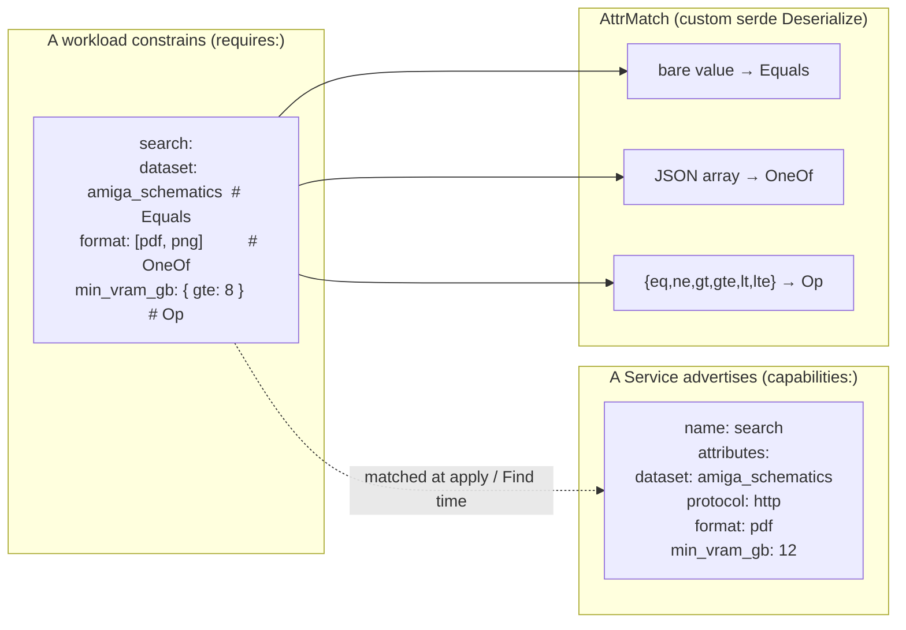

# 04 — Capabilities

The OrionMesh differentiator. Workloads constrain placement on **what services can do** (their advertised capabilities), not just on names. A capability is `{ name, attributes }` where attributes are nested JSON; the matcher dispatches on JSON shape into three forms — `Equals`, `OneOf`, and `Op` — so you can express "any LLM service with ≥ 24 GB VRAM serving the qwen-coder model" without a custom DSL.

> **Runnable.** `scripts/run-md.py examples/04-capabilities/README.md` walks the recipes end-to-end. Tags: `{name=X}`, `{skip}`, `{allow_fail}`, `{teardown}`.

## Concept



How the matching dispatch decides which variant a check is:

```
serde_json::Value::Array                                          → OneOf
serde_json::Value::Object whose keys are all in
  {eq, ne, gt, gte, lt, lte} (and not empty)                      → Op
anything else (string, number, bool, null, non-op object)         → Equals
```

The canonical implementation is `crates/orion-types/src/capability.rs` (custom `Deserialize` impl). The Demo tab's **Capability matcher** card is a faithful JS reproduction.

## The five files

| File | Demonstrates |
|---|---|
| [`advertise-search.yaml`](advertise-search.yaml) | A Service advertising two capabilities (`search` + `web`) with nested attributes |
| [`require-equals.yaml`](require-equals.yaml) | Selector with bare values → `Equals` for every attribute |
| [`require-oneof.yaml`](require-oneof.yaml) | Selector with a JSON array → `OneOf` |
| [`require-op.yaml`](require-op.yaml) | Selector with comparison ops (`{gte: 24}`) → `Op` |
| [`declared-schema.yaml`](declared-schema.yaml) | A `kind: Capability` resource declaring the attribute schema for `search` |

### Advertise

```yaml
kind: Service
metadata: { name: amiga-search-svc }
spec:
  runtime: { kind: docker, image: amiga-search:latest }
  capabilities:
    - name: search
      attributes:
        dataset: amiga_schematics
        protocol: http
        index_type: lucene
    - name: web
      attributes:
        protocol: http
```

A Service can advertise **multiple capabilities**. Each capability has a single `name` and an arbitrary `attributes` JSON value. The attributes shape is whatever you decide — the only convention is that the *requirements side* uses the same shape.

### Require — three forms

`Equals` — bare value, exact match:

```yaml
requires:
  search:
    dataset: amiga_schematics
    protocol: http
```

`OneOf` — JSON array, value must be ONE OF the list:

```yaml
requires:
  search:
    dataset: amiga_schematics
    format: [pdf, png]            # advertised "format" must be pdf OR png
```

`Op` — object whose only keys are `{eq, ne, gt, gte, lt, lte}`:

```yaml
requires:
  llm:
    gpu:
      min_vram_gb: { gte: 24 }    # advertised min_vram_gb must be ≥ 24
    context_window: { gte: 16000 }
```

Multiple ops in one object are AND-ed: `{ gt: 0, lt: 100 }` means `0 < x < 100`.

### Capability resource — declared schema

```yaml
kind: Capability
metadata: { name: search }
spec:
  capability: search
  description: "Full-text or vector lookup over a dataset"
  attribute_schema:
    type: object
    properties:
      dataset:    { type: string }
      protocol:   { type: string, enum: [http, grpc] }
      index_type: { type: string, enum: [lucene, tantivy, hnsw] }
      format:     { type: array, items: { type: string } }
```

Optional. A `kind: Capability` resource registers the attribute schema for `capability: search`; future tooling will use this to validate selectors at apply time (Phase 4). Today it parses and persists.

## Recipe — apply, list, try the matcher

```bash {name=build}
cargo build -p orion-cli
cargo build --release -p orion-controller -p orion-agent
```

```bash {name=validate-all}
for f in examples/04-capabilities/*.yaml; do
  ./target/debug/orion validate "$f"
done
```

```bash {name=apply-all}
CTRL=${ORION_CONTROLLER_URL:-http://127.0.0.1:7878}
for f in examples/04-capabilities/*.yaml; do
  curl -sS -X POST --data-binary @"$f" $CTRL/v1/resources/apply ; echo
done
```

Verify the catalog:

```bash {name=list}
CTRL=${ORION_CONTROLLER_URL:-http://127.0.0.1:7878}
echo "=== Services advertising capabilities ==="
curl -s $CTRL/v1/resources/Service | python3 -c "
import sys, json
for r in json.load(sys.stdin):
    caps = (r.get('spec') or {}).get('capabilities') or []
    if caps:
        print(f\"  {r['metadata']['name']}:\")
        for c in caps:
            print(f\"    - {c['name']}  attrs={c.get('attributes')}\")"

echo "=== Declared Capability schemas ==="
curl -s $CTRL/v1/resources/Capability | python3 -c "
import sys, json
for r in json.load(sys.stdin):
    s = r.get('spec') or {}
    print(f\"  {r['metadata']['name']:12} → {s.get('capability')} ({s.get('description','—')})\")"
```

Workload-side examples:

```bash {name=show-require-shapes}
echo "=== Equals (bare scalar) ==="
grep -A 6 'requires:' examples/04-capabilities/require-equals.yaml
echo
echo "=== OneOf (JSON array) ==="
grep -A 6 'requires:' examples/04-capabilities/require-oneof.yaml
echo
echo "=== Op (gte / lt / …) ==="
grep -A 7 'requires:' examples/04-capabilities/require-op.yaml
```

## Match the matcher manually (Python — same logic as the controller)

```bash {name=run-matcher}
python3 <<'PY'
import json, re

ADVERTISED = [
    {"name": "search",
     "attributes": {"dataset": "amiga_schematics", "format": "pdf", "min_vram_gb": 12}},
]

SELECTOR = {
    "search": {
        "dataset": "amiga_schematics",      # Equals
        "format":  ["pdf", "png"],          # OneOf
        "min_vram_gb": {"gte": 8},          # Op
    }
}

OP_KEYS = {"eq", "ne", "gt", "gte", "lt", "lte"}

def variant(check):
    if isinstance(check, list): return "OneOf"
    if isinstance(check, dict) and check and set(check) <= OP_KEYS: return "Op"
    return "Equals"

def matches(actual, check):
    v = variant(check)
    if v == "Equals": return actual == check, f"actual={actual!r} == {check!r}"
    if v == "OneOf":  return actual in check,  f"actual={actual!r} in {check!r}"
    if v == "Op":
        ok = True; why = []
        if "eq"  in check: ok = ok and actual == check["eq"]; why.append(f"eq={check['eq']}")
        if "ne"  in check: ok = ok and actual != check["ne"]; why.append(f"ne={check['ne']}")
        if "gt"  in check: ok = ok and actual >  check["gt"]; why.append(f"gt={check['gt']}")
        if "gte" in check: ok = ok and actual >= check["gte"]; why.append(f"gte={check['gte']}")
        if "lt"  in check: ok = ok and actual <  check["lt"]; why.append(f"lt={check['lt']}")
        if "lte" in check: ok = ok and actual <= check["lte"]; why.append(f"lte={check['lte']}")
        return ok, f"actual={actual!r} {','.join(why)}"

all_pass = True
for cap_name, attr_checks in SELECTOR.items():
    cap = next((c for c in ADVERTISED if c["name"] == cap_name), None)
    if not cap:
        print(f"  ✗ {cap_name} not advertised")
        all_pass = False; continue
    for attr_name, check in attr_checks.items():
        actual = cap["attributes"].get(attr_name)
        ok, detail = matches(actual, check)
        mark = "✓" if ok else "✗"
        print(f"  {mark} {cap_name}.{attr_name:14}  {variant(check):6}  {detail}")
        all_pass = all_pass and ok

print()
print("MATCH" if all_pass else "NO MATCH")
PY
```

## Tear down

```bash {teardown}
CTRL=${ORION_CONTROLLER_URL:-http://127.0.0.1:7878}
for n in amiga-search-svc search-frontend-strict doc-viewer long-context-summarize; do
  curl -sS -X DELETE $CTRL/v1/resources/Service/$n > /dev/null 2>&1 || true
  curl -sS -X DELETE $CTRL/v1/resources/Task/$n   > /dev/null 2>&1 || true
done
curl -sS -X DELETE $CTRL/v1/resources/Capability/search > /dev/null 2>&1 || true
echo "capability examples torn down"
```

## See also

- [`docs/ipc.md`](../../docs/ipc.md) — how capabilities will plumb through to the Find API (Phase 4)
- [`crates/orion-types/src/capability.rs`](../../crates/orion-types/src/capability.rs) — the canonical AttrMatch deserializer
- Demo tab → **Capability matcher** — interactive playground (faithful JS reproduction)
- [`examples/05-placement/`](../05-placement/) — hardware constraints (the *other* axis the scheduler uses)
