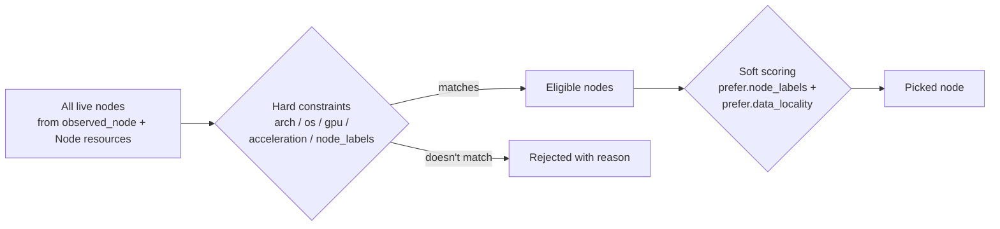

# 05 — Placement

`placement:` is the **hardware-and-labels** axis the scheduler filters and scores on. Hard constraints (`arch`, `os`, `gpu`, `acceleration`, `node_labels`) decide which nodes are *eligible*; soft preferences in the `prefer:` block decide which of the survivors is *best*. The other axis — what services can do — is in [04-capabilities](../04-capabilities/).

> **Runnable.** `scripts/run-md.py examples/05-placement/README.md` walks every recipe in this README end-to-end (with a `{teardown}` step at the end). See [`../docs/runner.md`](../docs/runner.md) for the tag conventions (`{name=X}`, `{skip}`, `{allow_fail}`, `{teardown}`) and the drive flags (`--list`, `--only X`, `--dry-run`, `--interactive`).

## Concept



Phase-1 substrate: `crates/orion-scheduler/src/lib.rs` implements `filter_nodes_by_placement` — the filtering half. The scoring half + multi-node spreading lands in Phase 5 alongside the reconciler.

## Placement spec — every field

```yaml
placement:
  arch: [arm64, x86_64]            # ANY-of (OR within the list)
  os:   [linux, macos]             # ANY-of

  gpu:                             # workload requirement (NOT the node-has descriptor)
    vendor: nvidia | amd | apple | intel | (omit for any)
    min_vram_gb: 24

  acceleration: cuda | metal | rocm | coreml | none

  node_labels: { site: belmont, power: mains }    # ALL-of (AND across keys)

  prefer:                          # soft scoring — survivors that match score higher
    node_labels: { power: mains, tier: gpu-rig }
    data_locality: true            # nodes that hold a referenced Dataset score higher
```

### Hard vs soft

| | What it does | How to read it |
|---|---|---|
| `arch / os` | List → any-of. Empty = anything. | "must be in this list" |
| `gpu` | Object — vendor optional, `min_vram_gb` optional. Both must hold if set. | "must have a GPU that satisfies these conditions" |
| `acceleration` | Single value enum. | "must support this acceleration" |
| `node_labels` | Map — every key must match exactly. | "must have ALL these labels set to these values" |
| `prefer.node_labels` | Same shape as `node_labels`. | "matching nodes get bonus points" |
| `prefer.data_locality` | Boolean. | "score nodes that already hold a referenced Dataset higher" |

### Node-has vs workload-requires for GPU

Two distinct types in the codebase:

```yaml
# On a Node resource — what a node HAS:
spec:
  gpus:
    - { vendor: nvidia, vram_gb: 24, name: "RTX 4090" }

# On a Service / Task placement — what a workload NEEDS:
spec:
  placement:
    gpu: { vendor: nvidia, min_vram_gb: 16 }
```

The filter matches each `placement.gpu` against the node's `gpus[]` array — a node passes if any one of its GPUs satisfies vendor + min_vram_gb. See `crates/orion-types/src/placement.rs` for the typed split.

## The five files

| File | What's distinctive |
|---|---|
| [`arch-only.yaml`](arch-only.yaml) | `arch: [arm64]` — Pi-only Service |
| [`gpu-required.yaml`](gpu-required.yaml) | `gpu: { vendor: nvidia, min_vram_gb: 24 }, acceleration: cuda` — strict GPU constraint |
| [`site-label.yaml`](site-label.yaml) | `node_labels: { site: belmont }` — site-pinned |
| [`prefer-soft.yaml`](prefer-soft.yaml) | Only soft preferences (`prefer:` block) — every node is eligible, some are better |
| [`combined.yaml`](combined.yaml) | All four together with inline `capabilities:` and `ports:` and `health:` |

### `arch-only.yaml`

```yaml
runtime: { kind: docker, image: ghcr.io/geekychris/sensor-collector:latest }
placement: { arch: [arm64], os: [linux] }
```

Only ARM64 Linux nodes are eligible. Macs and x86 boxes are out.

### `gpu-required.yaml`

```yaml
runtime: { kind: llm, model: qwen-coder, backend: vllm }
replicas: 1
placement:
  gpu: { vendor: nvidia, min_vram_gb: 24 }
  acceleration: cuda
  os: [linux]
```

The classic LLM-server constraint. Only NVIDIA boxes with ≥ 24 GB pass.

### `site-label.yaml`

```yaml
runtime: { kind: docker, image: eclipse-mosquitto:2 }
placement:
  node_labels: { site: belmont }
```

Only nodes labelled `site=belmont` are eligible. Add labels to a Node via its YAML `metadata.labels`.

### `prefer-soft.yaml`

```yaml
runtime: { kind: native, exec: /usr/local/bin/batch-runner }
placement:
  arch: [arm64, x86_64]                # hard
  prefer:
    node_labels: { power: mains }      # soft — bonus points for mains
    data_locality: true                # soft — bonus for nodes holding a Dataset
timeout_seconds: 3600
```

Every node passes; nodes on mains power and holding the referenced dataset score higher. The filter still returns *all* matching nodes; scoring is Phase 5.

### `combined.yaml`

Everything together — Service with hard placement, soft prefer, capabilities, ports, health, restart policy.

## Recipe — simulate placement against your live fleet

```bash {name=build}
cargo build -p orion-cli
cargo build --release -p orion-controller -p orion-agent
```

```bash {name=validate-all}
for f in examples/05-placement/*.yaml; do
  ./target/debug/orion validate "$f"
done
```

```bash {name=apply-all}
CTRL=${ORION_CONTROLLER_URL:-http://127.0.0.1:7878}
for f in examples/05-placement/*.yaml; do
  curl -sS -X POST --data-binary @"$f" $CTRL/v1/resources/apply ; echo
done
```

Simulate filter against your live fleet (Python — same logic as the Rust scheduler):

```bash {name=simulate}
CTRL=${ORION_CONTROLLER_URL:-http://127.0.0.1:7878}

# Pull the live fleet
NODES=$(curl -s $CTRL/v1/nodes)

# Run filter for a few synthetic placements
python3 <<PY
import json

nodes_raw = json.loads(r"""$NODES""")
fleet = []
for n in nodes_raw:
    inv = n.get("inventory") or {}
    fleet.append({
        "node_id": n["node_id"],
        "arch": inv.get("arch"),
        "os": inv.get("os"),
        "gpus": inv.get("gpus") or [],
        "labels": inv.get("labels") or {},
    })

def match(node, p):
    fails = []
    if p.get("arch") and node["arch"] not in p["arch"]:
        fails.append(f"arch {node['arch']} not in {p['arch']}")
    if p.get("os") and node["os"] not in p["os"]:
        fails.append(f"os {node['os']} not in {p['os']}")
    gpu = p.get("gpu") or {}
    if gpu and not any(
        (not gpu.get("vendor") or g.get("vendor") == gpu["vendor"]) and
        (not gpu.get("min_vram_gb") or g.get("vram_gb", 0) >= gpu["min_vram_gb"])
        for g in node["gpus"]
    ):
        fails.append(f"no GPU matching {gpu}")
    for k, v in (p.get("node_labels") or {}).items():
        if node["labels"].get(k) != v:
            fails.append(f"label {k} expected {v!r} got {node['labels'].get(k)!r}")
    return fails

SCENARIOS = {
    "arch=arm64":             {"arch": ["arm64"]},
    "os=linux":               {"os": ["linux"]},
    "gpu=nvidia ≥24GB":       {"gpu": {"vendor": "nvidia", "min_vram_gb": 24}},
    "site=belmont":           {"node_labels": {"site": "belmont"}},
    "everything":             {},
}
for label, placement in SCENARIOS.items():
    print(f"=== {label} ===")
    if not fleet:
        print("  (no nodes — start an agent)")
        continue
    for n in fleet:
        fails = match(n, placement)
        status = "✓" if not fails else "✗"
        reason = "" if not fails else "  — " + "; ".join(fails)
        print(f"  {status} {n['node_id']}{reason}")
PY
```

A small live test — does the gpu-required placement *actually* filter out demo-mac (which has no NVIDIA card)?

```bash {name=run-filtered-dispatch, allow_fail}
CTRL=${ORION_CONTROLLER_URL:-http://127.0.0.1:7878}
echo "=== applied gpu-required Service ==="
curl -sS -X POST --data-binary @examples/05-placement/gpu-required.yaml $CTRL/v1/resources/apply ; echo

echo "=== dispatch (today: no scheduler filtering; demo-mac gets it anyway) ==="
curl -sS -X POST $CTRL/v1/dispatch/Service/vllm-32b ; echo
echo
echo "Note: Phase 5 scheduler would refuse to dispatch when no node meets the gpu constraint."
echo "Today the controller picks the most-recent live node regardless of placement."
```

## Tear down

```bash {teardown}
CTRL=${ORION_CONTROLLER_URL:-http://127.0.0.1:7878}
for n in pi-sensor-collector vllm-32b belmont-mqtt-bridge batch-prefer-mains belmont-llm-frontend; do
  curl -sS -X DELETE $CTRL/v1/resources/Service/$n > /dev/null 2>&1 || true
  curl -sS -X DELETE $CTRL/v1/resources/Task/$n   > /dev/null 2>&1 || true
done
echo "placement examples torn down"
```

## See also

- [`crates/orion-scheduler/src/lib.rs`](../../crates/orion-scheduler/src/lib.rs) — the canonical filter implementation + tests
- Demo tab → **Placement simulator** — interactive simulation against your live fleet
- [`examples/04-capabilities/`](../04-capabilities/) — the *other* axis the scheduler uses
- [`examples/06-data/`](../06-data/) — Dataset resources that `prefer.data_locality` references
