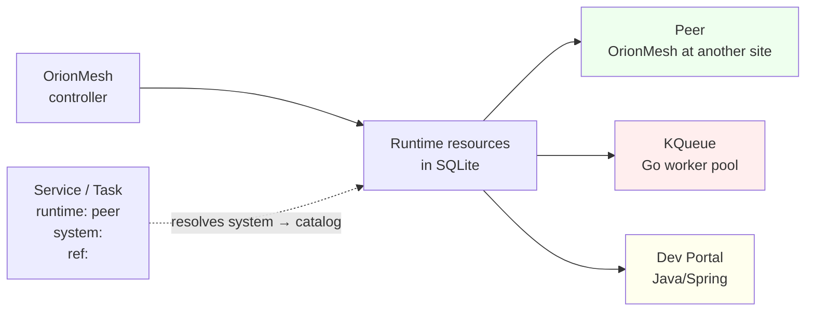

# 07 — Peer runtimes

OrionMesh treats Dev Portal, KQueue, and other OrionMesh instances as **peers, not parents**. Each is a `kind: Runtime` resource in the catalog; workloads can hand off via `runtime: { kind: peer, system: <name>, ref: <id> }`. Both sides stay independent — Dev Portal continues to work without OrionMesh and vice versa.

> **Runnable.** `scripts/run-md.py examples/07-peers/README.md` walks every recipe in this README end-to-end (with a `{teardown}` step at the end). See [`../docs/runner.md`](../docs/runner.md) for the tag conventions (`{name=X}`, `{skip}`, `{allow_fail}`, `{teardown}`) and the drive flags (`--list`, `--only X`, `--dry-run`, `--interactive`).

## Concept



Two distinct things:

1. **Catalog entry** — a `kind: Runtime` resource that names a peer system and tells OrionMesh where it lives.
2. **Delegation** — a Service or Task whose `runtime: { kind: peer, system: X, ref: Y }` defers execution to the named peer.

## Runtime catalog spec

```yaml
apiVersion: orionmesh.dev/v1
kind: Runtime
metadata: { name: orionmesh-belmont }
spec:
  runtime_kind: orionmesh           # orionmesh | kqueue | devportal | (future)
  base_url: "http://controller.belmont.local:7878"
  admin_ui_url: "http://controller.belmont.local:7879"
  config:                           # peer-specific extras
    natsUrl: "nats://nats.belmont.local:4222"
    description: "Sister mesh in the Belmont rack"
```

`runtime_kind` is the discriminator. `config` is freeform per kind.

## Peer delegation

```yaml
kind: Service
metadata: { name: ingest-worker }
spec:
  runtime:
    kind: peer
    system: kqueue-default          # references a kind:Runtime resource
    ref: image-ingest               # peer-specific identifier (KQueue queue name)
```

The agent's `peer` adapter (Phase 5) looks up the catalog entry, then talks to the peer's API to enqueue / dispatch / register.

## The five files

| File | Demonstrates |
|---|---|
| [`orionmesh-belmont.yaml`](orionmesh-belmont.yaml) | Peer OrionMesh at another site |
| [`kqueue-default.yaml`](kqueue-default.yaml) | KQueue instance with JetStream prefix |
| [`devportal-local.yaml`](devportal-local.yaml) | Local Dev Portal |
| [`service-via-kqueue.yaml`](service-via-kqueue.yaml) | Service delegating to KQueue |
| [`task-via-peer-mesh.yaml`](task-via-peer-mesh.yaml) | Task delegated to a peer OrionMesh |

## Recipe

```bash {name=build}
cargo build -p orion-cli
cargo build --release -p orion-controller -p orion-agent
```

```bash {name=validate-all}
for f in examples/07-peers/*.yaml; do
  ./target/debug/orion validate "$f"
done
```

```bash {name=apply-all}
CTRL=${ORION_CONTROLLER_URL:-http://127.0.0.1:7878}
for f in examples/07-peers/*.yaml; do
  curl -sS -X POST --data-binary @"$f" $CTRL/v1/resources/apply ; echo
done
```

Show the catalog:

```bash {name=list}
CTRL=${ORION_CONTROLLER_URL:-http://127.0.0.1:7878}
echo "=== Runtime catalog ==="
curl -s $CTRL/v1/resources/Runtime | python3 -c "
import sys, json
for r in json.load(sys.stdin):
    s = r['spec']
    print(f\"  {r['metadata']['name']:24} {s.get('runtime_kind'):10} {s.get('base_url')}\")"

echo
echo "=== Services / Tasks delegating to a peer ==="
for k in Service Task; do
  curl -s $CTRL/v1/resources/$k | python3 -c "
import sys, json
K = '$k'
for r in json.load(sys.stdin):
    rt = (r.get('spec') or {}).get('runtime') or {}
    if rt.get('kind') == 'peer':
        print(f\"  {K}/{r['metadata']['name']}  →  {rt.get('system')}  (ref={rt.get('ref')})\")"
done
```

Companion registration in Dev Portal (display only — Dev Portal must be running separately):

```bash {skip}
curl -X POST http://127.0.0.1:8081/api/peer-runtimes \
  -H "Content-Type: application/json" \
  -d '{
    "name": "orionmesh-belmont",
    "kind": "orionmesh",
    "baseUrl": "http://controller.belmont.local:7878",
    "adminUiUrl": "http://controller.belmont.local:7879",
    "config": { "natsUrl": "nats://nats.belmont.local:4222" }
  }'
```

## Tear down

```bash {teardown}
CTRL=${ORION_CONTROLLER_URL:-http://127.0.0.1:7878}
for n in orionmesh-belmont kqueue-default devportal-local; do
  curl -sS -X DELETE $CTRL/v1/resources/Runtime/$n > /dev/null 2>&1 || true
done
curl -sS -X DELETE $CTRL/v1/resources/Service/ingest-worker > /dev/null 2>&1 || true
curl -sS -X DELETE $CTRL/v1/resources/Task/belmont-nightly-rollup > /dev/null 2>&1 || true
echo "peer examples torn down"
```

## See also

- [`peer-integration/devportal/`](../../peer-integration/devportal/) — Dev Portal side (Flyway V9 + Java + MCP)
- [`crates/orion-devportal/`](../../crates/orion-devportal/) — Rust HTTP client (stub mode supported)
- [`CLAUDE.md`](../../CLAUDE.md) Decision 4 — peer with mutual independence
- [`docs/architecture.md §6.6`](../../docs/architecture.md#66-peer-integration--dev-portal-registration)
