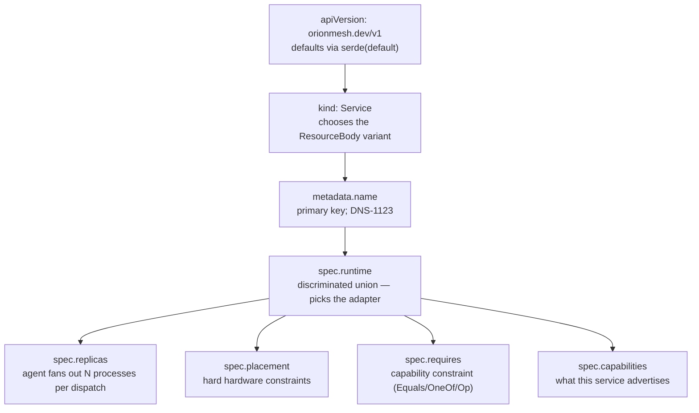

# 08 — Canonical example

`amiga-search.yaml` is **verbatim from** `OrionMesh_Architecture_Plan.md`. This is the shape every other example riffs on; if you only read one YAML in the repo, read this one.

> **Runnable.** `scripts/run-md.py examples/08-canonical/README.md` walks the recipes. Tags: `{name=X}`, `{skip}`, `{allow_fail}`, `{teardown}`.

## Files

| File | Source |
|---|---|
| [`amiga-search.yaml`](amiga-search.yaml) | Verbatim from the plan; also the YAML the `service_amiga_search_roundtrip` test in `crates/orion-types/src/tests.rs` parses. Editing it changes the test. |
| [`amiga-search-full.yaml`](amiga-search-full.yaml) | The same Service fleshed out with env, ports, health, capabilities, labels, prefer block |

## The plan's example, annotated

```yaml
apiVersion: orionmesh.dev/v1     # mandatory header; defaults if missing
kind: Service                    # discriminator for ResourceBody
metadata:
  name: amiga-search             # primary key (kind + namespace + name)
  labels: { site: belmont }      # routing / discovery / scheduler scoring
spec:
  runtime:                       # what to launch
    kind: docker
    image: amiga-search:latest
  replicas: 1                    # number of copies the agent fans out
  placement:                     # hardware filter
    arch: [arm64, x86_64]        #   ANY of these architectures
    os: [linux]                  #   AND must be Linux
  requires:                      # capability requirement
    search:                      # capability NAME
      dataset: amiga_schematics  #   the matched service must advertise
                                  #   `search.dataset == amiga_schematics`
  capabilities:                  # what THIS service advertises
    - name: search
      attributes:
        dataset: amiga_schematics
        protocol: http
```

That's the whole canonical shape: header + metadata + runtime + replicas + placement + requires + capabilities. Every other Service in the repo is some variation.

## Field-by-field walkthrough



| Block | What it shapes |
|---|---|
| `apiVersion` | Wire-format version. `orionmesh.dev/v1` today; reserves a path for v2. |
| `kind` | One of `Node, Service, Task, Job, Schedule, Dataset, Model, Project, Secret, Volume, Network, Runtime, Capability, Policy, Integration`. |
| `metadata.name` | Primary key on (kind, namespace, name). DNS-1123. |
| `metadata.labels` | Free-form `Map<String, String>`. Scheduler reads these for `node_labels` match (on Node) and the UI / Find API reads them for filtering. |
| `metadata.generation` | Bumped by the controller on every spec change. Status tracks `observed_generation` against this. |
| `spec.runtime` | The discriminator for which adapter launches the workload. Today: `native` is real. Phase 5: docker / python / java / node / spark / llm / ha / wasm. `peer` defers to a registered peer system. |
| `spec.replicas` | Agent launches N copies. Each copy gets `ORION_REPLICA_INDEX` and `ORION_REPLICA_COUNT` in its env. |
| `spec.placement` | Hard hardware constraints. Empty = matches anything. See [05-placement](../05-placement/). |
| `spec.requires` | Capability constraint — what services this workload needs to talk to. See [04-capabilities](../04-capabilities/). |
| `spec.capabilities` | What THIS service offers — the workload-side advertisement. |
| `spec.ports` | Named TCP/UDP ports. Phase 4 service discovery indexes by name. |
| `spec.health` | Liveness probe (Phase-5 reconciler reads this; today the agent ignores). |
| `spec.restart_policy` | `always` / `on_failure` / `never`. Phase-5 reconciler honours; today the agent doesn't auto-restart. |

## The fully-fleshed-out variant

```yaml
apiVersion: orionmesh.dev/v1
kind: Service
metadata:
  name: amiga-search
  namespace: portfolio
  labels: { site: belmont, tier: archive }
  annotations:
    description: "Lucene-backed search over the Amiga schematics dataset"
    repo: "https://github.com/geekychris/amiga_knowledge"
spec:
  runtime:
    kind: docker
    image: ghcr.io/geekychris/amiga-search:latest
    env:
      LUCENE_INDEX_PATH: /data/index
      AMIGA_SCHEMATICS_PATH: /data/amiga
    ports: [8080, 9090]
  replicas: 1
  placement:
    arch: [arm64, x86_64]
    os: [linux]
    node_labels: { site: belmont }
    prefer:
      data_locality: true            # bonus for nodes holding amiga-schematics
  requires:
    search: { dataset: amiga_schematics }
  capabilities:
    - name: search
      attributes:
        dataset: amiga_schematics
        protocol: http
        index_type: lucene
        format: [pdf, png]
    - name: web
      attributes:
        protocol: http
        path: /
  ports:
    - { name: http,    port: 8080 }
    - { name: metrics, port: 9090 }
  health:
    kind: http
    path: /healthz
    port: 8080
    interval_seconds: 10
    failure_threshold: 3
  restart_policy: on_failure
```

That's "everything a Service can be" — most real Services use a small subset.

## Recipe

```bash {name=build}
cargo build -p orion-cli
cargo build --release -p orion-controller -p orion-agent
```

```bash {name=validate-and-roundtrip}
./target/debug/orion validate examples/08-canonical/amiga-search.yaml
./target/debug/orion validate examples/08-canonical/amiga-search-full.yaml
```

```bash {name=apply}
CTRL=${ORION_CONTROLLER_URL:-http://127.0.0.1:7878}
curl -sS -X POST --data-binary @examples/08-canonical/amiga-search.yaml      $CTRL/v1/resources/apply ; echo
curl -sS -X POST --data-binary @examples/08-canonical/amiga-search-full.yaml $CTRL/v1/resources/apply ; echo
echo "=== back from the store ==="
curl -s $CTRL/v1/resources/Service/amiga-search | python3 -m json.tool | head -40
```

Roundtrip via the unit test (this is what the in-tree test does):

```bash {name=cargo-test}
cargo test -p orion-types service_amiga_search_roundtrip
```

## Tear down

```bash {teardown}
CTRL=${ORION_CONTROLLER_URL:-http://127.0.0.1:7878}
curl -sS -X DELETE $CTRL/v1/resources/Service/amiga-search > /dev/null 2>&1 || true
echo "canonical example torn down"
```

## See also

- [`OrionMesh_Architecture_Plan.md`](../../OrionMesh_Architecture_Plan.md) — the source of this example
- [`crates/orion-types/src/tests.rs`](../../crates/orion-types/src/tests.rs) — `service_amiga_search_roundtrip` test
- All the per-aspect example directories (01-07) — each riff on different fields of this canonical shape
