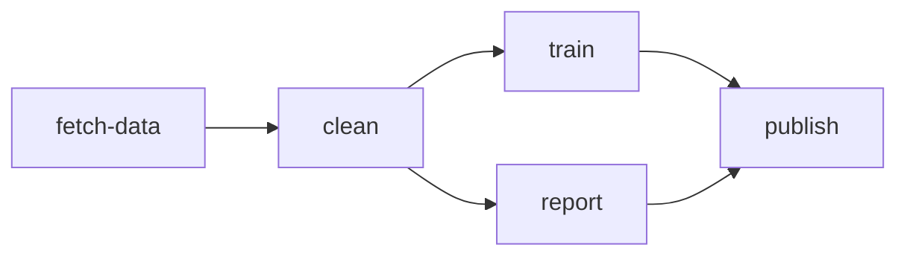

# 11 · Workflows — DAGs of Tasks

A **Workflow** is a directed acyclic graph of Tasks. Each step names a
`Task` resource that already exists; `depends_on` lists which steps must
finish before this one starts. The controller's workflow runner ticks
every few seconds, dispatches root steps, watches `orion.task.events`
for completions, and fans out the next layer.

> **Runnable.** `scripts/run-md.py examples/11-workflows/README.md`
> walks every block. The `{teardown}` block always runs last.

## Concept



Each box is a `Task` resource. The Workflow says: fetch first, then
clean, then run train and report in parallel, then publish once both are
done. The runner watches Task instance exits via the existing
`task.events` substream, so workflows compose with the reconciler and
restart_policy with no extra wiring.

## 0 · Stack

```bash {name=prereq}
docker ps --format '{{.Names}}' | grep -q orion-nats || \
    docker run -d --rm --name orion-nats -p 4222:4222 nats:2.10 -js
pkill -f orion-controller 2>/dev/null || true
pkill -f orion-agent 2>/dev/null || true
sleep 1
cargo build --workspace --quiet
ORION_AUTH_DISABLED=1 ORION_STORE_PATH=sqlite::memory: \
    target/debug/orion-controller --bind 127.0.0.1:7878 >/tmp/orion-ctrl.log 2>&1 &
sleep 1
ORION_AUTH_DISABLED=1 \
    target/debug/orion-agent --node-id local-dev --heartbeat-interval 2 >/tmp/orion-agent.log 2>&1 &
sleep 2
target/debug/orion doctor
```

## 1 · Define five tiny Tasks

Each one prints a banner and exits. Real workflows would do real work;
these stand in.

```bash {name=tasks}
ORION=target/debug/orion
for step in fetch-data clean train report publish; do
    cat <<EOF | $ORION apply -f -
apiVersion: orionmesh.dev/v1
kind: Task
metadata: { name: ${step} }
spec:
  runtime:
    kind: native
    exec: /bin/sh
    args: ["-c", "echo '[${step}] starting'; sleep 2; echo '[${step}] done'"]
EOF
done
$ORION get tasks
```

## 2 · Define the Workflow

```bash {name=workflow}
ORION=target/debug/orion
cat <<'EOF' | $ORION apply -f -
apiVersion: orionmesh.dev/v1
kind: Workflow
metadata: { name: build-pipeline }
spec:
  description: "fetch → clean → (train, report) → publish"
  steps:
    - name: step-fetch
      task: fetch-data
    - name: step-clean
      task: clean
      depends_on: [step-fetch]
    - name: step-train
      task: train
      depends_on: [step-clean]
    - name: step-report
      task: report
      depends_on: [step-clean]
    - name: step-publish
      task: publish
      depends_on: [step-train, step-report]
EOF
$ORION get workflows
```

## 3 · Watch it run

The workflow runner ticks every 3 seconds. With each Task taking 2 seconds,
the full DAG drains in about 12-15 seconds.

```bash {name=run}
ORION=target/debug/orion
echo "=== watching workflow progress ==="
for i in 1 2 3 4 5 6 7 8 9 10; do
    sleep 3
    progress=$(curl -s http://127.0.0.1:7878/v1/workflows/observed)
    echo "tick $i: $progress" | head -c 200 ; echo
    # Stop when finished_at appears.
    if echo "$progress" | grep -q '"finished_at"'; then
        echo "=== workflow finished ==="
        break
    fi
done
```

## 4 · Inspect logs per step

Each step is a Task instance; logs show up via the standard logs endpoint.

```bash {name=logs}
ORION=target/debug/orion
for step in fetch-data clean train report publish; do
    echo "--- $step ---"
    $ORION logs Task $step | tail -3
done
```

## 5 · Fail-fast vs continue-on-error

This Workflow uses fail-fast (the default). If `clean` had failed,
`train` / `report` / `publish` would have been marked `Failed` without
ever running. Set `spec.continue_on_error: true` to run downstream
steps even after a failure (useful for "best-effort report generation"
flows).

```bash {name=fail-fast-demo skip}
# Demonstration only — apply a Workflow whose middle Task fails, watch
# downstream get auto-failed. Tagged {skip} so it doesn't break the runner.
ORION=target/debug/orion
cat <<'EOF' | $ORION apply -f -
apiVersion: orionmesh.dev/v1
kind: Task
metadata: { name: always-fails }
spec:
  runtime: { kind: native, exec: /bin/sh, args: ["-c", "echo about-to-fail; exit 1"] }
EOF
cat <<'EOF' | $ORION apply -f -
apiVersion: orionmesh.dev/v1
kind: Workflow
metadata: { name: fail-fast-demo }
spec:
  steps:
    - { name: a, task: fetch-data }
    - { name: b, task: always-fails, depends_on: [a] }
    - { name: c, task: train, depends_on: [b] }
EOF
sleep 12
curl -s http://127.0.0.1:7878/v1/workflows/observed | python3 -m json.tool
```

## 6 · Teardown

```bash {teardown}
ORION=target/debug/orion
$ORION delete workflow build-pipeline 2>/dev/null || true
$ORION delete workflow fail-fast-demo 2>/dev/null || true
for t in fetch-data clean train report publish always-fails; do
    $ORION delete task $t 2>/dev/null || true
done
pkill -f orion-controller 2>/dev/null || true
pkill -f orion-agent 2>/dev/null || true
docker stop orion-nats 2>/dev/null || true
echo "torn down"
```

## What this proves

| Capability | Evidence |
|---|---|
| DAG ordering | `step-clean` doesn't run until `step-fetch` finishes |
| Parallel fan-out | `step-train` and `step-report` both start as soon as `step-clean` completes |
| Join | `step-publish` waits for *both* train and report |
| Composition with reconciler | Each Task is dispatched via the standard `/v1/dispatch` path; reconciler / restart_policy / health all still apply |
| Observability | `/v1/workflows/observed` returns the per-step status + timestamps; `orion get workflows` shows the desired state |

See [docs/queues.md](../../docs/queues.md) and
[docs/runtime.md](../../docs/runtime.md) for the underlying substrate
(JetStream for `task.events`, native runtime for actual execution).
