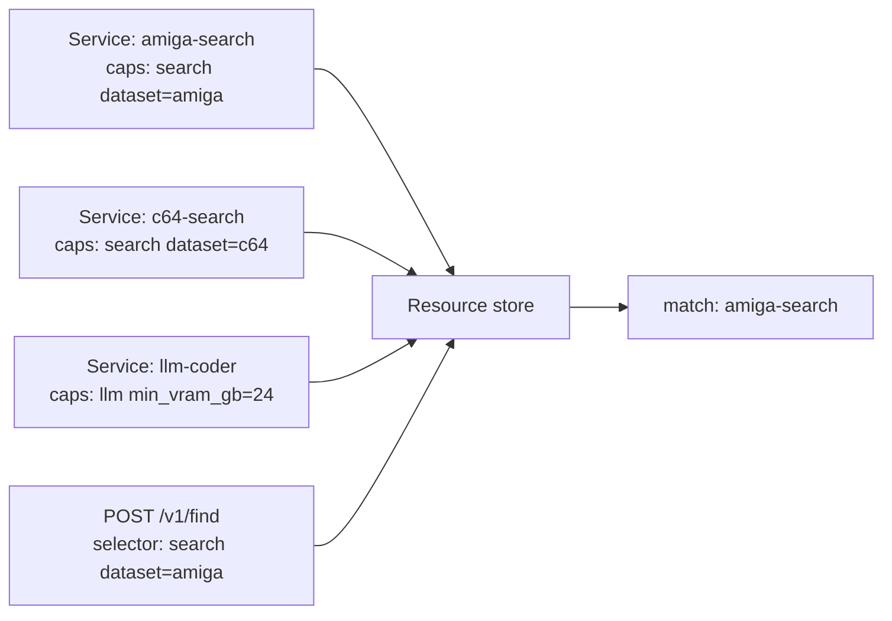

# 12 · Find API — capability-aware service discovery

Services can advertise capabilities + attributes. Consumers describe what
they need; the controller returns the subset that matches. This is the
"right workload on the right machine" pitch made concrete.

## Concept



`AttrMatch` supports three shapes:

| Selector shape | Wire | Behaviour |
|---|---|---|
| Bare value | `dataset: amiga` | exact equals |
| Array | `format: [gguf, safetensors]` | one-of |
| Op object | `min_vram_gb: { gte: 24 }` | numeric comparison (eq/ne/gt/gte/lt/lte) |

## 0 · Stack

```bash {name=prereq}
docker ps --format '{{.Names}}' | grep -q orion-nats || \
    docker run -d --rm --name orion-nats -p 4222:4222 nats:2.10 -js
pkill -f orion-controller 2>/dev/null || true
sleep 1
cargo build --workspace --quiet
ORION_AUTH_DISABLED=1 ORION_STORE_PATH=sqlite::memory: \
    target/debug/orion-controller --bind 127.0.0.1:7878 >/tmp/orion-ctrl.log 2>&1 &
sleep 2
target/debug/orion doctor --no-fail 2>&1 | head -5
```

## 1 · Advertise three services with distinct capabilities

```bash {name=apply}
ORION=target/debug/orion
cat <<'EOF' | $ORION apply -f -
apiVersion: orionmesh.dev/v1
kind: Service
metadata: { name: amiga-search, labels: { tier: edge } }
spec:
  runtime: { kind: native, exec: /bin/true }
  capabilities:
    - name: search
      attributes:
        dataset: amiga
        protocol: http
EOF

cat <<'EOF' | $ORION apply -f -
apiVersion: orionmesh.dev/v1
kind: Service
metadata: { name: c64-search }
spec:
  runtime: { kind: native, exec: /bin/true }
  capabilities:
    - name: search
      attributes:
        dataset: c64
        protocol: http
EOF

cat <<'EOF' | $ORION apply -f -
apiVersion: orionmesh.dev/v1
kind: Service
metadata: { name: llm-coder-24 }
spec:
  runtime: { kind: native, exec: /bin/true }
  capabilities:
    - name: llm
      attributes:
        model: qwen-coder
        min_vram_gb: 24
        format: gguf
EOF

cat <<'EOF' | $ORION apply -f -
apiVersion: orionmesh.dev/v1
kind: Service
metadata: { name: llm-mini-8 }
spec:
  runtime: { kind: native, exec: /bin/true }
  capabilities:
    - name: llm
      attributes:
        model: phi-mini
        min_vram_gb: 8
        format: gguf
EOF

$ORION get services
```

## 2 · Exact-match selector

`search.dataset=amiga` should return only `amiga-search`.

```bash {name=find-exact}
ORION=target/debug/orion
$ORION find -r search.dataset=amiga
```

## 3 · Numeric selector

LLMs with at least 16 GB of VRAM — `llm-coder-24` matches, `llm-mini-8`
doesn't.

```bash {name=find-numeric}
ORION=target/debug/orion
$ORION find -r 'llm.min_vram_gb={"gte":16}'
```

## 4 · One-of selector

Models in either `gguf` or `safetensors` format — both LLMs match.

```bash {name=find-oneof}
ORION=target/debug/orion
$ORION find -r 'llm.format=["gguf","safetensors"]'
```

## 5 · Composite selector — multiple capabilities

A consumer that needs *both* a search capability over the C64 dataset
*and* an LLM — none of these services advertise both, so the result is
empty.

```bash {name=find-composite}
ORION=target/debug/orion
$ORION find -r search.dataset=c64 -r llm.model=phi-mini
```

## 6 · Raw selector JSON via REST

```bash {name=find-rest}
ORION=target/debug/orion
curl -s -X POST http://127.0.0.1:7878/v1/find \
    -H 'content-type: application/json' \
    -d '{"search":{"dataset":"amiga"}}' | python3 -m json.tool | head -15
```

## 7 · Teardown

```bash {teardown}
ORION=target/debug/orion
for s in amiga-search c64-search llm-coder-24 llm-mini-8; do
    $ORION delete service $s 2>/dev/null || true
done
pkill -f orion-controller 2>/dev/null || true
docker stop orion-nats 2>/dev/null || true
echo "torn down"
```

## What you can use this for

- "Which service can serve the amiga schematics dataset?" → discovery
  for clients
- "Find an LLM with at least 24 GB VRAM" → scheduler-as-tool
- "Any service that exposes a `metrics` capability over HTTP" →
  observability sweep

The same selector grammar is what `placement.requires` uses on Service
specs — the controller's scheduler picks a node by filtering against
each node's advertised capabilities. The Find API exposes that same
filtering as a query.

See [`docs/queues.md`](../../docs/queues.md) for capabilities as a
declarative model (not just an API).
