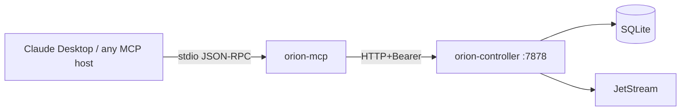

# 13 · MCP server — drive OrionMesh from Claude (or any MCP host)

`orion-mcp` is a stdio JSON-RPC server that exposes the controller's
REST API as MCP tool calls. Wire it into Claude Desktop or any other
MCP-capable agent and the model can dispatch services, query queues,
read logs, find capabilities, etc., without you shelling out to
`orion` by hand.

## Tools exposed

| Tool | Maps to |
|---|---|
| `orion_list_nodes` | GET /v1/nodes |
| `orion_list_services` | GET /v1/resources/Service |
| `orion_list_tasks` | GET /v1/resources/Task |
| `orion_list_queues` | GET /v1/resources/Queue |
| `orion_get_resource` | GET /v1/resources/{kind}/{name} |
| `orion_apply_resource` | POST /v1/resources/apply (YAML body) |
| `orion_delete_resource` | DELETE /v1/resources/{kind}/{name} |
| `orion_dispatch` | POST /v1/dispatch/{kind}/{name} |
| `orion_logs` | GET /v1/logs/{kind}/{name} |
| `orion_find_capability` | POST /v1/find |
| `orion_doctor` | GET /v1/diag/system |
| `orion_diag_system` | GET /v1/diag/system |
| `orion_diag_jetstream` | GET /v1/diag/jetstream |

## 0 · Stack + install

```bash {name=prereq}
docker ps --format '{{.Names}}' | grep -q orion-nats || \
    docker run -d --rm --name orion-nats -p 4222:4222 nats:2.10 -js
pkill -f orion-controller 2>/dev/null || true
sleep 1
cargo build --workspace --quiet
ORION_AUTH_DISABLED=1 ORION_STORE_PATH=sqlite::memory: \
    target/debug/orion-controller --bind 127.0.0.1:7878 >/tmp/orion-ctrl.log 2>&1 &
sleep 2
target/debug/orion doctor --no-fail 2>&1 | head -5
# orion-mcp lives at ~/.orion/bin/orion-mcp after `scripts/install-bins.sh`.
ls -la target/debug/orion-mcp
```

## 1 · Sanity check — drive the MCP server manually

Send a single tool call over stdin and read the response:

```bash {name=manual-rpc}
echo '{"jsonrpc":"2.0","id":1,"method":"tools/list"}' | \
    target/debug/orion-mcp 2>/dev/null | python3 -m json.tool | head -40
```

You should see the 13 tools listed with their input schemas.

## 2 · Drive a real workflow via the MCP transport

```bash {name=full-flow}
ORION_MCP=target/debug/orion-mcp

# Apply a service via apply tool
echo '{"jsonrpc":"2.0","id":1,"method":"tools/call","params":{"name":"orion_apply_resource","arguments":{"yaml":"apiVersion: orionmesh.dev/v1\nkind: Service\nmetadata: { name: mcp-svc }\nspec:\n  runtime: { kind: native, exec: /bin/sh, args: [\"-c\", \"echo hello-from-mcp; sleep 1\"] }\n"}}}' | \
    $ORION_MCP 2>/dev/null

# Dispatch it
echo '{"jsonrpc":"2.0","id":2,"method":"tools/call","params":{"name":"orion_dispatch","arguments":{"kind":"Service","name":"mcp-svc"}}}' | \
    $ORION_MCP 2>/dev/null

sleep 2

# Read logs
echo '{"jsonrpc":"2.0","id":3,"method":"tools/call","params":{"name":"orion_logs","arguments":{"kind":"Service","name":"mcp-svc"}}}' | \
    $ORION_MCP 2>/dev/null | python3 -m json.tool | head -20
```

## 3 · Wire into Claude Desktop

Add this to `~/Library/Application Support/Claude/claude_desktop_config.json`
(macOS) or the equivalent on your platform:

```json
{
  "mcpServers": {
    "orion": {
      "command": "/Users/YOU/.orion/bin/orion-mcp",
      "env": {
        "ORION_CONTROLLER_URL": "http://127.0.0.1:7878"
      }
    }
  }
}
```

(Run `scripts/install-bins.sh` first so `orion-mcp` is on PATH at the
absolute location above. The MCP server is just a process; Claude
Desktop launches it for each session and pipes JSON-RPC over its stdin
and stdout.)

Restart Claude Desktop. In a new chat:

> "List the services running on my OrionMesh cluster."

Claude will call `orion_list_services` via MCP, get back the JSON,
and summarise.

> "Apply a Queue called `events` of type `topic`, then dispatch a
> Service called `watcher` that consumes from it."

Claude composes the YAML, calls `orion_apply_resource`, calls
`orion_dispatch`. No shell required.

## 4 · Teardown

```bash {teardown}
target/debug/orion delete service mcp-svc 2>/dev/null || true
pkill -f orion-controller 2>/dev/null || true
docker stop orion-nats 2>/dev/null || true
echo "torn down"
```

## How it works



The MCP server is a thin layer. It maps tool calls 1:1 to controller
HTTP calls, passes the Bearer token from `ORION_CLUSTER_TOKEN`, returns
the JSON response (or an `RpcError` on a 4xx/5xx).

For auth-enforced clusters, set `ORION_CLUSTER_TOKEN` in the MCP
server's env block in `claude_desktop_config.json`.

## See also

- [docs/queues.md](../../docs/queues.md) — what `orion_list_queues` returns
- [docs/multi-host.md](../../docs/multi-host.md) — running this against a
  remote cluster (set `ORION_CONTROLLER_URL` to your control host)
- [crates/orion-mcp/src/lib.rs](../../crates/orion-mcp/src/lib.rs) — the
  tool definitions and the dispatch implementation
