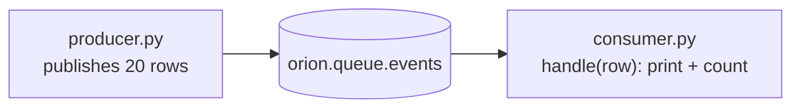

# 14 · Python client — drive OrionMesh without the CLI

Same end-to-end pipeline as `examples/10-queues/`, but everything (declare
queue, publish rows, consume them) happens from Python code — no `orion`
shell calls. The same client is what you'd embed in a long-running app
that wants to be an OrionMesh participant.

## What you'll build



Both scripts use `from orion_mesh import Client`. The consumer runs as
an OrionMesh Service so the reconciler keeps it alive.

## 0 · Prereq stack

```bash {name=prereq}
docker ps --format '{{.Names}}' | grep -q orion-nats || \
    docker run -d --rm --name orion-nats -p 4222:4222 nats:2.10 -js
pkill -f orion-controller 2>/dev/null || true
pkill -f orion-agent 2>/dev/null || true
sleep 1
cargo build --workspace --quiet
ORION_AUTH_DISABLED=1 ORION_STORE_PATH=sqlite::memory: \
    target/debug/orion-controller --bind 127.0.0.1:7878 >/tmp/orion-ctrl.log 2>&1 &
sleep 1
ORION_AUTH_DISABLED=1 \
    target/debug/orion-agent --node-id local-dev --heartbeat-interval 2 >/tmp/orion-agent.log 2>&1 &
sleep 2
target/debug/orion doctor
```

## 1 · Install the Python client

```bash {name=install}
python3 -m venv examples/14-python-client/.venv
. examples/14-python-client/.venv/bin/activate
pip install --quiet -e clients/python
python -c "import orion_mesh; print('orion-mesh', orion_mesh.__version__)"
```

## 2 · Declare the queue and publish from Python

The producer doesn't need to know about `orion gen queue` or YAML — it
calls `c.apply(...)` directly.

```bash {name=produce}
. examples/14-python-client/.venv/bin/activate
python examples/14-python-client/producer.py
```

You should see 20 messages published and the queue's `messages: 20`
line at the end.

## 3 · Run the consumer as an OrionMesh Service

The Service spec points at the host's Python interpreter and the
consumer script. The agent launches it; the reconciler keeps it alive.

```bash {name=consumer-as-service}
. examples/14-python-client/.venv/bin/activate
target/debug/orion apply -f examples/14-python-client/consumer-service.yaml
target/debug/orion dispatch Service py-consumer
sleep 6
target/debug/orion logs Service py-consumer | grep -E "got|count=" | head -10
```

Each row prints `got: {...}`. The script also keeps a running total per
basename so the last few log lines show the count distribution.

## 4 · Run it again from another machine (same client, different language)

The Python client doesn't care where you call it from. To prove the
boundary: run the producer in a subshell with a different
`ORION_CONTROLLER_URL` (pointed at your controller's external IP) —
output is identical. For a local round-trip:

```bash {name=second-publish}
. examples/14-python-client/.venv/bin/activate
ORION_CONTROLLER_URL=http://127.0.0.1:7878 python examples/14-python-client/producer.py --count 5 --prefix "second-batch"
sleep 3
target/debug/orion logs Service py-consumer | grep "second-batch" | wc -l
```

## 5 · Composite — apply + dispatch + tail in one Python script

Demonstrates the full client surface in a single script for someone who
wants to bootstrap a cluster purely from Python (CI, deployment tools,
etc.).

```bash {name=composite}
. examples/14-python-client/.venv/bin/activate
python examples/14-python-client/full_flow.py
```

## 6 · Teardown

```bash {teardown}
target/debug/orion delete service py-consumer 2>/dev/null || true
target/debug/orion delete queue events 2>/dev/null || true
pkill -f orion-controller 2>/dev/null || true
pkill -f orion-agent 2>/dev/null || true
docker stop orion-nats 2>/dev/null || true
echo "torn down"
```

## What you learned

| Concept | Method |
|---|---|
| Apply YAML or dict | `c.apply(...)` |
| Get / list / delete | `c.get`, `c.list`, `c.delete` |
| Dispatch + log tail | `c.dispatch`, `c.logs` |
| Queue subject / stream resolution | `c.queue(name).subject`, `.stream` |
| Publish | `q.pub({...})` returns the JetStream sequence |
| Subscribe | `for row in q.sub(group=..., limit=N): ...` |

The same client embeds cleanly in FastAPI handlers, CLI tools, Airflow
DAGs, etc. See [`clients/python/README.md`](../../clients/python/README.md)
for the API reference and [`docs/queues.md`](../../docs/queues.md) for
how the queue semantics work under the hood.
