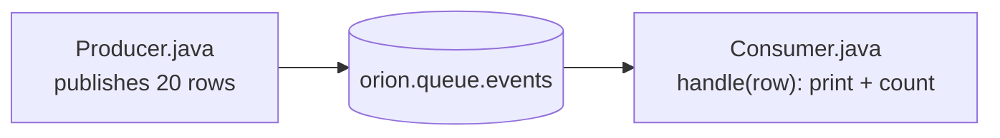

# 15 · Java client — drive OrionMesh from Java

Same flow as `examples/14-python-client/`, but the producer and the
consumer Service are both Java. The consumer is a fat-jar that the
agent launches via `kind: native exec: java -jar ...`.

## What you'll build



## 0 · Prereq stack

```bash {name=prereq}
docker ps --format '{{.Names}}' | grep -q orion-nats || \
    docker run -d --rm --name orion-nats -p 4222:4222 nats:2.10 -js
pkill -f orion-controller 2>/dev/null || true
pkill -f orion-agent 2>/dev/null || true
sleep 1
cargo build --workspace --quiet
ORION_AUTH_DISABLED=1 ORION_STORE_PATH=sqlite::memory: \
    target/debug/orion-controller --bind 127.0.0.1:7878 >/tmp/orion-ctrl.log 2>&1 &
sleep 1
ORION_AUTH_DISABLED=1 \
    target/debug/orion-agent --node-id local-dev --heartbeat-interval 2 >/tmp/orion-agent.log 2>&1 &
sleep 2
target/debug/orion doctor
```

## 1 · Build the example fat jar

```bash {name=build}
cd examples/15-java-client && mvn -q package && cd -
ls examples/15-java-client/target/*.jar
```

## 2 · Publish 20 rows from Java

```bash {name=publish}
java -jar examples/15-java-client/target/producer.jar
```

## 3 · Dispatch the consumer as an OrionMesh Service

```bash {name=consume}
target/debug/orion apply -f examples/15-java-client/consumer-service.yaml
target/debug/orion dispatch Service java-consumer
sleep 6
target/debug/orion logs Service java-consumer | head -10
```

## 4 · Teardown

```bash {teardown}
target/debug/orion delete service java-consumer 2>/dev/null || true
target/debug/orion delete queue events 2>/dev/null || true
pkill -f orion-controller 2>/dev/null || true
pkill -f orion-agent 2>/dev/null || true
docker stop orion-nats 2>/dev/null || true
echo "torn down"
```

## See also

- [`clients/java/README.md`](../../clients/java/README.md) — API reference
- [`docs/queues.md`](../../docs/queues.md) — queue semantics
