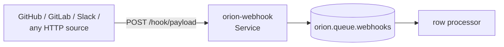

# 19 · Webhook receiver — turn any HTTP POST into a queue message

`orion-webhook` runs as a Service. POST anything to it; it lands on a
queue. Optional HMAC-SHA256 signature verification matches what
GitHub / GitLab / Slack-style integrations send.

## What you'll build



## 0 · Stack

```bash {name=prereq}
docker ps --format '{{.Names}}' | grep -q orion-nats || \
    docker run -d --rm --name orion-nats -p 4222:4222 nats:2.10 -js
pkill -f orion-controller 2>/dev/null || true
pkill -f orion-agent 2>/dev/null || true
sleep 1
cargo build --workspace --quiet
ORION_AUTH_DISABLED=1 ORION_STORE_PATH=sqlite::memory: \
    target/debug/orion-controller --bind 127.0.0.1:7878 >/tmp/orion-ctrl.log 2>&1 &
sleep 1
ORION_AUTH_DISABLED=1 \
    target/debug/orion-agent --node-id local-dev --heartbeat-interval 2 >/tmp/orion-agent.log 2>&1 &
sleep 2
```

## 1 · Deploy the receiver

```bash {name=deploy}
ORION=target/debug/orion
$ORION gen queue webhooks --type work | $ORION apply -f -
$ORION apply -f examples/19-webhook/webhook-service.yaml
$ORION dispatch Service orion-webhook
sleep 3
curl -s http://127.0.0.1:8080/health
```

## 2 · POST a payload

```bash {name=test-post}
curl -X POST http://127.0.0.1:8080/hook/test \
    -H 'content-type: application/json' \
    -d '{"event":"push","repo":"orion_mesh","sha":"deadbeef"}'
```

## 3 · Consume from the queue

```bash {name=consume}
target/debug/orion queue sub webhooks --group test --limit 1 2>&1 | head -3
```

You should see a row with `body` (the parsed JSON), `headers`, and
`_subject` (the path-suffixed subject so consumers can filter).

## 4 · With HMAC signature verification

```bash {name=signed-demo skip}
# (Marked {skip} for the runner — manual demo.)
SECRET=mysecret
# Re-deploy with WEBHOOK_SECRET set:
sed "s/# WEBHOOK_SECRET.*/WEBHOOK_SECRET: $SECRET/" \
    examples/19-webhook/webhook-service.yaml | $ORION apply -f -
$ORION restart service orion-webhook

# Sign and POST
BODY='{"event":"x"}'
SIG=$(echo -n "$BODY" | openssl dgst -sha256 -hmac "$SECRET" | awk '{print $2}')
curl -X POST http://127.0.0.1:8080/hook \
    -H "X-Hub-Signature-256: sha256=$SIG" \
    -d "$BODY"
```

## 5 · Teardown

```bash {teardown}
target/debug/orion delete service orion-webhook 2>/dev/null || true
target/debug/orion delete queue webhooks 2>/dev/null || true
pkill -f orion-controller 2>/dev/null || true
pkill -f orion-agent 2>/dev/null || true
docker stop orion-nats 2>/dev/null || true
echo "torn down"
```
