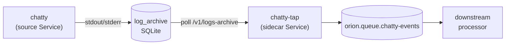

# 20 · Sidecar — re-publish another Service's log lines to a queue

`orion gen sidecar` emits a companion Service that polls the controller's
log archive for a source Service and republishes its lines to a queue
(optionally filtered by regex). The "I want to react to log events from
another workload" pattern.

## What you'll build



## 0 · Stack

```bash {name=prereq}
docker ps --format '{{.Names}}' | grep -q orion-nats || \
    docker run -d --rm --name orion-nats -p 4222:4222 nats:2.10 -js
pkill -f orion-controller 2>/dev/null || true
pkill -f orion-agent 2>/dev/null || true
sleep 1
cargo build --workspace --quiet
ORION_AUTH_DISABLED=1 ORION_STORE_PATH=sqlite::memory: \
    target/debug/orion-controller --bind 127.0.0.1:7878 >/tmp/orion-ctrl.log 2>&1 &
sleep 1
ORION_AUTH_DISABLED=1 \
    target/debug/orion-agent --node-id local-dev --heartbeat-interval 2 >/tmp/orion-agent.log 2>&1 &
sleep 2
```

## 1 · Apply the chatty source + queue

```bash {name=source}
ORION=target/debug/orion
$ORION gen queue chatty-events --type work | $ORION apply -f -
cat <<'EOF' | $ORION apply -f -
apiVersion: orionmesh.dev/v1
kind: Service
metadata: { name: chatty }
spec:
  replicas: 1
  restart_policy: always
  runtime:
    kind: native
    exec: /bin/sh
    args: ["-c", "for i in $(seq 1 50); do echo \"[INFO] tick-$i\"; if [ $((i % 5)) = 0 ]; then echo \"[ERROR] bad-thing-$i\" 1>&2; fi; sleep 1; done"]
EOF
$ORION dispatch Service chatty
```

## 2 · Generate + dispatch the sidecar (ERROR-only filter)

```bash {name=sidecar}
ORION=target/debug/orion
$ORION gen sidecar chatty-tap --source chatty --queue chatty-events --filter "ERROR" | $ORION apply -f -
$ORION dispatch Service chatty-tap
```

## 3 · Subscribe to see only the filtered events

```bash {name=verify}
sleep 12
target/debug/orion queue sub chatty-events --group reader --limit 2 2>&1 | head -6
```

You should only see lines that matched `ERROR` — the `[INFO] tick-*` lines
were filtered out at the sidecar.

## 4 · Teardown

```bash {teardown}
target/debug/orion delete service chatty 2>/dev/null || true
target/debug/orion delete service chatty-tap 2>/dev/null || true
target/debug/orion delete queue chatty-events 2>/dev/null || true
pkill -f orion-controller 2>/dev/null || true
pkill -f orion-agent 2>/dev/null || true
docker stop orion-nats 2>/dev/null || true
echo "torn down"
```

## How it works

The sidecar polls `GET /v1/logs-archive/Service/<source>?since=<last_ts>`
every `SIDECAR_INTERVAL_SECONDS` (default 5). Each returned line goes
through the optional `SIDECAR_FILTER_REGEX` and (if it passes) gets
published as a `SidecarEvent` to the queue.

The cursor (`since`) is in-memory; if the sidecar restarts it picks up
from the controller's current latest. For exactly-once delivery,
combine with a deduper at the consumer side keyed on `at`.

## Use cases

- "Wake a Task when the web service logs an ERROR"
- "Build a metrics counter off log volume"
- "Fan in logs from N services to a single processing queue"
- "Audit trail" — apply a regex-filter sidecar with the line itself archived elsewhere
