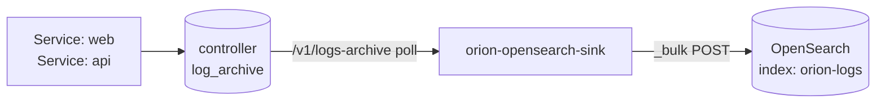

# 22 · OpenSearch log sink

Ships log lines from one or more OrionMesh Service/Task workloads into
OpenSearch (or Elasticsearch — the bulk API is identical) for
full-text search and dashboarding.

## How it works



The sink crate polls the controller's persistent log archive — same
data you'd get from `orion logs Service web` — and POSTs batches to
the OpenSearch bulk API. Cursor is per-workload, in-memory; restart
picks up at the controller's current latest.

## Env

| Var | Required | Default |
|---|---|---|
| `OPENSEARCH_URL` | ✓ | |
| `OPENSEARCH_INDEX` | | `orion-logs` |
| `OPENSEARCH_USERNAME` | | (unset) |
| `OPENSEARCH_PASSWORD` | | (unset) |
| `ORION_CONTROLLER_URL` | | `http://127.0.0.1:7878` |
| `LOG_SOURCE_KIND` | | `Service` |
| `LOG_SOURCE_NAMES` | ✓ | (comma-separated) |
| `SINK_INTERVAL_SECONDS` | | `10` |

## Walkthrough

```yaml
# opensearch-sink.yaml
apiVersion: orionmesh.dev/v1
kind: Service
metadata: { name: opensearch-sink }
spec:
  replicas: 1
  restart_policy: on_failure
  runtime:
    kind: native
    exec: target/debug/orion-opensearch-sink
    args: []
    env:
      OPENSEARCH_URL: "https://opensearch.local:9200"
      OPENSEARCH_INDEX: orion-logs
      OPENSEARCH_USERNAME: admin
      OPENSEARCH_PASSWORD: admin
      ORION_CONTROLLER_URL: "http://127.0.0.1:7878"
      LOG_SOURCE_KIND: Service
      LOG_SOURCE_NAMES: "web,api,worker"
      SINK_INTERVAL_SECONDS: "10"
      RUST_LOG: info
```

Apply + dispatch:

```bash
orion apply -f opensearch-sink.yaml
orion dispatch Service opensearch-sink
# Then search OpenSearch — `_index=orion-logs name:web AND line:error`
```

## Doc shape (indexed JSON)

```json
{
  "at": "2026-06-30T12:00:00Z",
  "kind": "Service",
  "name": "web",
  "node_id": "raspberry-pi",
  "stream": "stdout",
  "line": "the actual log line"
}
```

Use OpenSearch's date-on-`at`, term-on-`name`, keyword-on-`stream`,
full-text-on-`line`.

## Why use this

- Cross-service log search (the controller's `/v1/logs/search` walks
  the ring buffer; this is full-corpus and persists indefinitely)
- Dashboards in OpenSearch Dashboards / Kibana
- SIEM / audit / compliance pipelines
- Long-term retention beyond what the SQLite log archive holds
